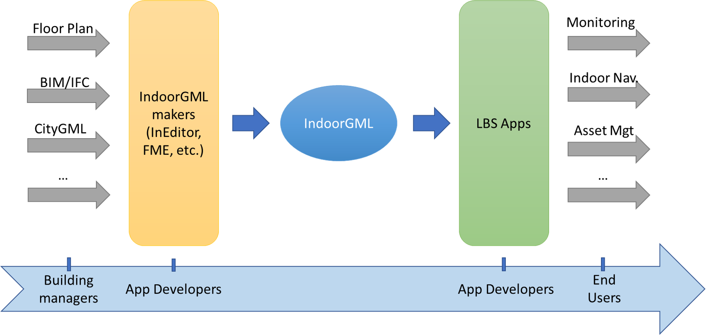
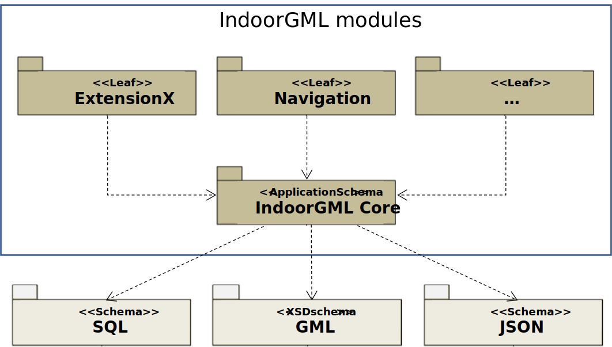

[[section-overview]]
== Overview of IndoorGML

The IndoorGML Conceptual Model is designed to support applications developers in providing Location-based services applications.
<<fig-overview-indoorgml>> illustrates the place of IndoorGML in an ecosystem of standards, models, and files formats and end-user applications.
IndoorGML provides simplified yet standardized notations for indoor spaces and networks, which can be used in different application contexts such as navigation, monitoring, asset and property management.
IndoorGML can be linked to and derived from any geometric model that a building owner may have (floor plans, CAD models, BIM models, laser scans, measurements).
The semantics notations of IndoorGML are generic and therefore support protecting some sensitive building information.

[[fig-overview-indoorgml]]
.IndoorGML in the overall application development ecosystem

[[section-motivation]]
=== Motivation for developing the IndoorGML Standard

Indoor environments differ from outdoor in many aspects.
Indoor spaces have fewer structures, lanes, and directions to move.
They are multi-levelled and reachable via different vertical connectors such as stairs, elevators, escalators, and ramps.
They have large number of obstacles such as furniture columns, fences, decorations. Indoor spaces are enclosed and accessible via different types of openings (normal doors, emergency doors, sliding doors, one-way doors, portals).
The height of the indoor spaces might vary to such an extent that some spaces are not accessible for certain type of users.
This has led to the existence of a variety of approaches for modelling indoor environments and providing services.
Therefore, well-known concepts, data models, and standards need to be refined and unified to reflect specifics of indoor environments.

In general, indoor spatial information can be classified into two large categories as follows:

* Architectural components (walls, stairs, slabs) and interior facilities (furniture).
* Cavities (rooms and corridors) or virtual subdivision (sensors coverage and legal spaces)

Building and facility management applications require mostly information from the first category.
Indoor location-based services (LBS), indoor route analysis or indoor geo-tagging services require mostly information from the second category.

The IndoorGML Standard is intended to provide a unified modelling approach that is necessary to support indoor applications using information from those two categories.
The leading concepts in the IndoorGML Conceptual Model are the Indoor spaces and the topological relationships between them (<<section-space>>), which are grounded in the Poincaré duality.
The space notations are kept as generic as possible to reflect the variety and complexity of indoor environments.
The entire indoor environment - objects and spaces - constitutes the Cellular space (<<section-cellularspace>>).
Cells have properties, one of which is their geometry.
The cell units can be subdivided or aggregated (<<section-cellularspace>>).
The Cell Spaces are the basis for deriving an adjacency/connectivity/accessibility network (<<section-poincareduality>>).
Cell Spaces of the same characteristics are non-overlapping and form a thematic layer (<<section-thematiclayers>>).
For example, architectural components (walls, slabs, stairs) and the corresponding cavities (rooms, corridors) form a Topographic thematic layer.

IndoorGML 2.0 follows a model-driven approach.
All concepts are organized in a UML class diagram (<<section-data-model>>), from which the implementation schemas for GML are provided (<<annex_ATS,Annex A>>).

[[section-modularisation]]
=== Modularization

Following the <<OGC_08-131r3,OGC ModSpec guidance (OGC, 2009)>>, IndoorGML Part 1 – Conceptual Model is organised into a Core module and Extension modules that have one or more mandatory dependencies on the Core (see <<fig-modular>>).
The IndoorGML Core module defines generic aspects of Primal-Dual spaces (see below) and each extension module introduces thematic semantics for a specific application. IndoorGML 2.0 Part 1 contains one extension named _Navigation_.
IndoorGML 2.0 Part 2 provides the implementation of IndoorGML 2.0 Part 1 Conceptual model in GML, JSON, and SQL.

The dependency relationships among IndoorGML’s modules are illustrated in <<fig-modular>>.
Each module is represented by a package in UML.
The package name corresponds to the module name.
A dash arrow in the figure indicates that the schema at the tail of the arrow depends upon the schema at the head of the arrow.
In the following sections the modules are described in detail.

[[fig-modular]]
.Modular organisation of IndoorGML
