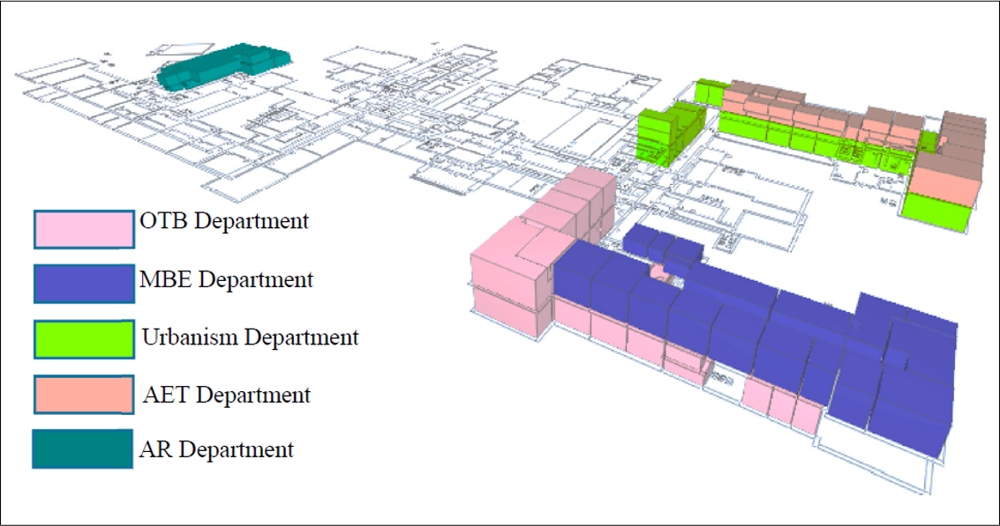
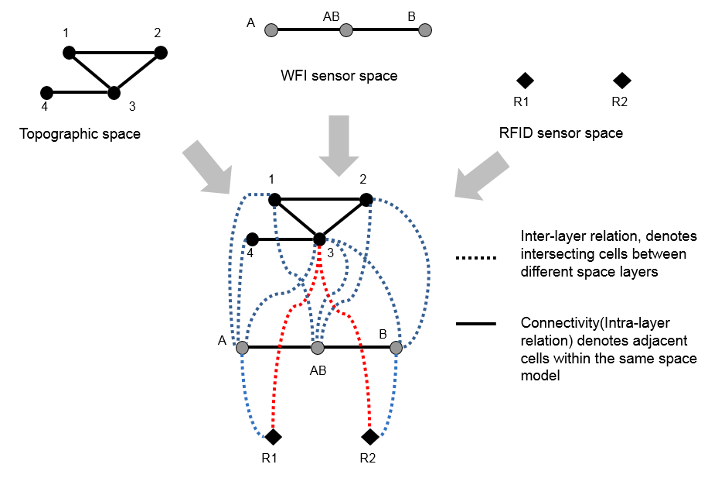

[[section-general-concepts]]
== General Concepts of IndoorGML

IndoorGML is a space-centred standard.
As such, it focuses on the three main types of information of spaces (2D or 3D): geometry, topology and semantic.
To define the space and its suitable properties under the consideration of those three types of information, the Standard relies on the following concepts:

* Cellular space,
* Poincaré Duality,
* Semantic extension,
* Thematic layering.

The cellular space provides the geometric description of an IndoorGML model.
The Poincaré duality describes the topological relations such as adjacency and connectivity between the spaces.
Together, they form the key concept of the Primal-Dual model that defines the core part of the IndoorGML Conceptual Model.
The semantic extension mechanism, as the name suggests, supports adding more details to the basic semantics of the core module.
Thematic layering mechanism supports organizing an IndoorGML model as a collection of layers with different themes.
Those concepts are elaborated in the following subsections.

[[section-space]]
=== Space

The notion of space is widely explored in spatial science and urban applications in general (<<zlatanova2020spaces,Zlatanova, et al., 2020>>).
Among the diverse definitions that can be found in dictionaries and related literature, one definition of the space encapsulates most of the concepts attached it:

"_Space is either unlimited expanse or an empty area usually bounded in some way between things (e.g., the architect left space in front of the building) or an area reserved for some particular purpose (e.g., the laboratory’s floor space)"_ (<<wordnet,Princeton University, 2010>>).

That definition acknowledges three main aspects of the space:
(a) its ability to expand infinitely,
(b) its intuition to be generally empty and eventually bounded (particularly in the built environment) and
(c) its functional property.
In IndoorGML, the space is characterized by all those properties, except that an IndoorGML space is not necessarily empty.
Depending on the IndoorGML extension (indoor navigation, sensors coverage, ownership, etc.) spaces can be empty, non-empty or partially empty.

Indoor space is commonly perceived as a space within a building.
It incorporates architectural components such as walls, slabs, and doors, and furniture such as chairs, tables, desks, and the remaining empty spaces as in rooms, corridors, halls, etc.
IndoorGML 2.0 Conceptual Model focuses on the empty spaces where objects can be located, and activities can be hosted for indoor navigation or LBS.
Consequently, the relationships between spaces are of critical importance.

Spaces in the built environment are not always sharply distinguishable.
Many spaces cannot be strictly categorized as indoor or outdoor, but rather as semi-spaces often linking indoor and outdoor environments (<<yan2019generic,Yan, Diakité, & Zlatanova, 2019>>; <<zlatanova2020spaces,Zlatanova, et al., 2020>>).
For example, an inner court, a veranda, a balcony, or an open bridge can belong to a building, without being entirely enclosed within the shell of the building.
Nevertheless, for a matter of completeness, the IndoorGML Conceptual Model can account for all types of space within the built environment, if they can be represented with the IndoorGML Cellular space concept (below).

[[section-cellularspace]]
=== Cellular space

A _cellular space_ is a set of _cells_ (or _CellSpaces_) defined as the smallest organizational or structural unit (<<wordnet,Princeton University, 2010>>) and grouped according to thematic criteria (e.g. topographic space, sensor coverage space, etc.).
A cellular space _S_ of thematic layer _T_, noted _S_^_T_^ is defined as follows:

_S_^_T_^= {_c_~1~, _c_~2~, …, _c_~_n_~}

where _c_~_i_~ is _i_^th^ cell.
Every cell in a cellular space can have the following properties:

* a unique identifier;
* a name (e.g., a room number);
* a geometry (e.g., solids in 3D or surfaces in 2D)

<<fig-cellular-space>> illustrates a cellular space consisting of cells, which represent rooms, corridors, doors and windows in a building.

[[fig-cellular-space]]
.A building (a) and the corresponding cellular space, containing all empty cells (b) and corresponding cells of a room, a corridor and their openings (c).
image::./figures/FIG4.png[align="center"]

Within a cellular space, only the adjacency relationship is allowed between cells: No overlap may occur.
Overlapping cells must be organized in a new cellular space.
A cellular space may be incomplete coverage: There can be gaps between cells (<<fig-cellular-space-2>>).

[[fig-cellular-space-2]]
.Cellular space containing disconnected cells, i.e., all offices in a university building (<<alattas2017supporting,Allatas et al., 2017>>)

In the IndoorGML Conceptual Model, a cellular space can be subdivided into smaller cells or aggregated into larger ones.
Those operations detailed in <<subsection-subdivision>> allow for both a tailored geometric granularity and functional specification of spaces.

[[subsection-geometry]]
==== Geometry

Every cell defining an item in indoor space owns a shape, size, and location that can be collected and modelled.
Cell can represent physical features such a room, door, wall, or virtual spaces such as legal rights and access or sensors coverages.
Depending on the application, the geometry of a cell can be simplified and generalised into a polygon or rectangle.
Such an approach can be applied when considering highly irregular shapes such as furniture.
Geometric information can be included in an IndoorGML implementation instance either directly or via an external link.
Geometry of cells can be omitted as well.

Cell geometry is defined in 2-dimensional or 3-dimensional Euclidean space and provides the means for the quantitative description of the spatial characteristics of cell.
Metrics are defined as in (<<topologywithouttears,Morris, 2019>>).
In the IndoorGML Conceptual Model, cells are modelled as features and conform with requirements as specified in ISO 19107 (Spatial Schema) (<<ISO_19107,ISO, 2019>>).
ISO 19107 provides conceptual schemas to describe and model real world objects as features.

[[fig-geometry]]
.Three options to represent geometry in IndoorGML

As illustrated in <<fig-geometry>>, there are three options for representing geometry of a cell in indoor space:

. Geometry in IndoorGML (Option 1): Geometric representation of a cell may be included within an IndoorGML document. As defined in ISO 19107 this is a GM_Solid in 3D space and GM_Surface in 2D space. Note that solid with holes or surface with holes are allowed in this standard.
. External Reference (Option 2): Instead of explicit representation of geometry, an IndoorGML document can only contain external links to objects defined in data sets is some encoding/format such as IFC or CityGML, where the referenced objects in external data set include geometric information. Then there must be 1:1 or _n_:1 mapping from cells in IndoorGML to these corresponding objects in other datasets.
. No Geometry (Option 3): No geometric information is included in IndoorGML. This means that the shape, extent and location are unknown. The cell is defined by its identifier.

Note that Option 2 can always be used in combination with the other options.
When Option 1 is used, three fundamental operations can be applied to cell spaces: subdivision, aggregation, and selection.

[[subsection-topology]]
==== Topology

Beside the geometry of a cellular space, cells can be represented in a topological model, which specifies the relationships between points, lines, polygons and solids constructing the geometry (<<gerhard2012geometry,Gröger and George, 2012>>).
Such topological models are dedicated to representing spatial relationships. As such, their shape and size are not described (<<egenhofer1989formal,Egenhofer et al., 1989>>).
This is to say, geometric predicates such as volumes, areas, distances cannot be computed.
As mentioned above, IndoorGML deals only with cells in 3D and 2D space, which are defined as solids or polygons.
Consequently, the topological model contains only 3D and 2D objects in 3D cellular space and 2D and 1D objects in 2D cellular space.
More information about topology of cells can be found in <<subsection-primalspacelayer>>.

[[subsection-subdivision]]
==== Subdivision, aggregation, and selection

The indoor environment is complex and indoor spaces often have hierarchical structures.
For several indoor applications, a careful decomposition of an indoor space is required to reflect these hierarchical structures.
To support the representation of such configurations, the subdivision, aggregation, and selection processes on the CellSpaces can be applied.

[[fig-subdivision-and-aggregation]]
.(a) A furnished indoor space. (b) Subdivision of the indoor space into two separate rooms with exclusion of furnishing elements’ spaces. (c) Selection of specific CellSpaces (green) suitable for walking and rolling. (d) CellSpaces (green) suitable for flying.
image::./figures/FIG7.png[align="center"]

As illustrated in <<fig-subdivision-and-aggregation>>, the subdivision is performed by splitting the original cells into several subspaces, according to the function of cell.
For example, in <<fig-subdivision-and-aggregation>>(b), the indoor space is subdivided into several cells according to their functions (e.g. as in <<fig-subdivision-and-aggregation>>(a)) into a kitchen and a living room, as well as discriminating the spaces physically occupied by items.
The subdivision process could be based on any application-based criteria and all resulting subspaces are CellSpaces of a cellular space.
For navigation applications, subdivisions may be required due to:

* Geometry simplification such as working with spaces that have only convex shapes.
* Increase of granularity such as in for improving the localisation of people and items.
* Need to identify specific functional/perception spaces such as waiting or smoking areas.
* Defining free spaces such as spaces free of obstacles.

The aggregation process is the reverse of the subdivision process.
An aggregation process results in subspaces being merged instead of being split.
Therefore, the merging of all subspaces shown in <<fig-subdivision-and-aggregation>>(a) allows retrieving the original cell spaces.
Similarly, any new cell resulting from this process is a CellSpace of a cellular space.
For the purpose of indoor navigation, aggregation may be required when:

* There are CellSpaces of no interest for an application, such as individual toilets or service areas in a building.
* There are CellSpaces, which are not accessible for specific users, such as restricted areas at hospitals and airports.

Finally, it is possible to discriminate CellSpaces of interest from the rest.
<<fig-subdivision-and-aggregation>>(c) and (d) illustrate a scenario where only CellSpaces that can support certain type of locomotion modes are considered in the cellular space (see the green CellSpaces).
The selection of spaces for indoor navigation applications can take place for many different reasons:

* To reduce the overall number of spaces such as selecting only empty spaces, such as rooms and corridors and avoid non-empty spaces such as walls, slabs, or too crowded areas.
* To eliminate spaces, which will not be used for a specific user such as selecting only common spaces for someone visiting a public building.
* Eliminating spaces of danger such as in emergency cases, select only spaces which are still safe for users to be in.

[[section-poincareduality]]
=== Poincaré Duality

Topological relations between cells are crucial in the IndoorGML model.
They allow establishing links between cells in the same or different thematic layers.
This is critical information for several applications such as navigation, which relies on connectivity networks.
As mentioned above, a topological model of cellular space is partial and represents only relations between cells and their boundaries.
The Poincaré duality (<<munkres1984lements,Munkres, 1984>>) is further employed to explicitly describe the relationships between the cells.
The Poincaré duality provides a theoretical background for mapping cellular space to a graph or network to represent allowed topological relationships.
It simplifies the complex spatial relationships, which may occur in a 3D topological model (<<lee2004spatial,Lee, 2004>>).

The Poincaré duality refers to two spaces: Primal Space and Dual Space.
A _k_-dimensional object in _N_-dimensional Primal Space is mapped to (_N_-k) dimensional object in Dual Space.
Thus, solid 3D objects in 3D Primal space, such as rooms within a building, are mapped to nodes (0D object) in dual space.
A 2D surface shared by two 3D objects is transformed into an edge (1D) linking the two nodes in Dual space.
The nodes and edges in Dual space form an adjacency graph.
The nodes and the edges in Dual space represent abstractions of cells and their adjacency relationships in Primal space.

[[fig-poincare-duality]]
.Principles of Poincaré duality. 3D Primal space case (a) and 2D case (b). (Mathematical definition of Poincaré duality in (<<munkres1984lements,Munkres, 1984>>))
image::./figures/FIG8.png[align="center"]

<<fig-poincare-duality>> illustrates this duality transformation for the case where the primal space is 3D (a) and 2D (b) respectively.
Note that the transformations from 1D object (curve) or 0D object (point) in 3D Primal space are not included in the IndoorGML model since they are not considered as cells in most applications.
However, the transformation may be applied to 1D or 0D objects of 3D primal space in a similar way if it is required. Then the adjacency graph _G_~_adj_~ is defined as follows:

[.text-center]
_G_~_adj_~ = (_V_, _E_~_adj_~)

where _V_ and _E_~_adj_~ are sets of nodes and edges in dual space mapped from cells and surfaces in 3D primal space, respectively.
The connectivity graph _G_~_con_~ is a subset of the adjacency graph and represents only adjacency that make the spaces connected.
For navigation cases connectivity between spaces (i.e. room) is provided via the notion of doors between the rooms.
Connectivity graph is defined as:

[.text-center]
_G_~_con_~ = (_V_, _E_~_con_~)

where _V_ and _E_~_con_~ are sets of nodes and edges in dual space mapped from cells and surfaces in 3D primal space, respectively. <<fig-poincare-duality-2>> illustrates cellular space and its connectivity graph.

[[fig-poincare-duality-2]]
.Poincaré duality on 3D cells of a building (a); Corresponding adjacency graph in the dual space (b); Combined primal and dual space view (c).

The adjacency graph can be represented as a _logical network_ or _geometric network_.
While the logical network represents only the relationships between the cells, the geometric network holds geometry for nodes and edges.

[[section-structuredspacemodel]]
=== Structured space model

The Primal and Dual spaces and the Euclidean and Topological spaces are interlinked in a Structured Space Model as illustrated in <<fig-structured-space>>.
The Primal space refers to either Euclidean or Topological space and the Dual space refers to either the Geometric network or the Logical network.
Geometry of Cellular Space and Geometric Network are embedded in the Euclidean space, while Topology of Cellular Space and Logical Network are defined in the Topological space.
IndoorGML supports the Primal and Dual models in the Euclidean space and the Logical Network in the Topological space.
As mentioned above, the Geometry for Cellular space is not compulsory, as the cellular space can be identified.
An IndoorGML encoding is valid with at least one of the Primal spaces.
See examples in <<section-datadictionary>>.

The Euclidean space (Geometry) is estimated to be the most useful for applications such as navigation and LBS.
An IndoorGML encoding may then contain both Geometry and Geometry Network, or only Geometry, or only Geometric Network.
Other types of applications, such as dealing with ownership or sensor coverage, may be better supporter by an IndoorGML encoding containing Geometry and Logical Network or Topology and Logical Network.

[[fig-structured-space]]
.Structured space model: mapping between Euclidean and Topological spaces, and Primal and Dual Spaces

[[section-semantics]]
=== Semantics
The IndoorGML model contains the semantic for the Primal and Dual spaces of the core module.
The semantics of the core model are generic for all applications.
It specifies only some characteristics such as name, level, and Point of Interest (PoI).
If no extension module is involved, the cells carry the semantics of the core module only.

Further semantic specifications are provided via the Extension modules as explained in <<section-indoorgml-navigation>>.
Every cell is further classified according to the semantics introduced by the extension module.
The IndoorGML 2.0 Model defines semantics for Indoor navigation that are provided within the Navigation extension module.
The semantics, defined in the Navigation extension module, are intended for two purposes to: 1) provide a classification of a cell, and 2) determine adjacency relationships that ensure connectivity between cells.
Semantics thus supports defining cells that are important for navigation.
Thus, a cell can be classified as navigable (room, corridor, hall), non-navigable (wall, slab, furniture), opening (door, window), etc. (see <<section-indoorgml-navigation>>).
The subdivision and classification of Cellular space relies on the architectural layout of a building.

While this may be enough for some cases based on connectivity graph analysis, it can rapidly be limiting for more specialized applications such as sensor managements, legal aspects, or security.
These latter applications require advanced, specific semantic needs to be associated to the geometric and topological elements.
Examples can be a Legal Extension module, in which a cell might be classified as ‘ownership’, ‘restriction’, ‘responsibility’ etc. or a Security extension module that may offer semantics that would indicate ‘check-in’, ‘boarding’, ‘crew entrance’, etc.

The semantic extension mechanism enables adding more semantic on primal or dual spaces, as long as they follow the modularization principle.
Cells can be organized in a hierarchical structure according to their semantics, corresponding properties, and semantic interrelations (specialization and generalization).
For example, ‘room’ is a specialization of ‘navigable cell’ and ‘non-navigable cell’ is a generalization of ‘walls’ and ‘obstacles’.
Cells created for one space representation may be aggregated or subdivided for the purpose of another one.
More details about the Navigation extension module are given in <<section-indoorgml-navigation>>.

[[section-thematiclayers]]
=== Thematic layers

A single indoor environment can be organized in many kinds of cellular spaces with distinct subdivision and semantic specifications.
Within each Extension module, it is possible to have many different subdivisions and each cellular space is targeted towards specific applications and needs.
A cellular space with a specific semantics and/or geometric subdivision, aiming to reflect a group of application can be organized in a _Thematic Layer_.
Thematic layers can be defined using the Extension modules and/or Core module.
Thematic layers making use of the semantics of Core module only, can be derived applying the principles of space partitioning, such as subdivision, aggregation and selection.
Examples of such thematic layers are subdivision according to Wi-Fi or RFID coverage (see example below)footnote:disclaimer[While the reference to Wi-Fi and RFID as Indoor Positioning Systems (IPS) is essentially indicative, a wider family of IPS technologies known as Real-Time Locating Systems (RTLS) are increasingly being adopted. Future versions of IndoorGML will consider a better integration to such technologies through, for example, integration with existing open standards in that space such as Omlox (https://omlox.com/).].
The Navigation extension module provides additional notions for navigability and connectivity.
Therefore, thematic layers that rely of these properties should include the Navigation extension module.
Navigation-based themes can be defined using a particular space partitioning with respect to:

* Tasks: visitor, staff, facility manager, emergency responder (see <<fig-cellular-space-visitor>>)
* User characteristics: age, gender
* Mode: walking, driving, flying (see <<fig-subdivision-and-aggregation>>(c) and (d))

IndoorGML 2.0 is organized as a collection of interconnected layers representing different themes of the same physical space.
<<fig-cellular-space-visitor>> represents a thematic layer ‘Visitors’, which contains all cells, which are accessible to visitors in a university facility (<<alattas2017supporting,Alattas et al., 2017>>).
Similarly, cellular spaces can be created for students or facility management.
All spaces use the semantics of the Navigation extension module, but a selection of spaces is made according to the user tasks.
Similarly, cellular spaces from different extension modules can be organized into thematic layers.

[[fig-cellular-space-visitor]]
.Cellular space for visitors (<<alattas2017supporting,Alattas et al., 2017>>)
image::./figures/FIG11.png[align="center"]

In <<fig-cellular-space-same-physical>>, a physical indoor space named Topographic layer is organized according to the Navigation extension module.
In addition, two thematic layers called Wi-Fi and RFID are specified, which rely on the semantics of the core model only.
The Topographic layer, created under the Navigation extension module, follows the architectural layout of a building, and is composed of rooms, corridors, and stairs.
Wi-Fi and RFID cells follow the outlines of the corresponding sensor coverages.
The three cellular spaces, although related to subdivision approaches, each form a thematic layer.
These three thematic layers may be appropriate for an application that provides tracking and navigation.

Following the modularization mechanisms, every layer in IndoorGML contains the core module, which is composed of Primal space and Dual space.
A valid thematic layer should contain at least one of the four space representations: Geometry, Topology, Geometric network, or Logical network.

[[fig-cellular-space-same-physical]]
.Three different cellular spaces for the same physical space.
image::./figures/FIG12.svg[align="center"]

[[subsection-multiplelayeredspace]]
==== Multiple-Layered Space representation

The IndoorGML model provides mechanisms for maintaining and linking multiple Thematic layers for the same indoor environment.
<<fig-corresponding-primal-dual-space>> represents the three thematic layers discussed above.

[[fig-corresponding-primal-dual-space]]
.Corresponding Primal and Dual spaces of different thematic layers.
image::./figures/FIG13.png[align="center"]

This representation method with multiple cellular space layers is called _Multiple Layered Space Representation_ (MLS Representation).
The MLS representation is useful for many purposes.
For example, representing the hierarchical structure of indoor space, where each floor level is a single space layer.
Another application example is indoor tracking using presence sensors, such as RFID, as shown in <<fig-cellular-space-same-physical>>.
Given an indoor space represented as a Topographic layer and RFID sensor coverage layer respectively, the movement of a mobile object can be deduced using a RFID tag by the sequence of RFID coverage cells and corresponding inter-layer space edges.

[[subsection-interlayerrelation]]
==== Inter-Layer Relations

To handle the interaction between several layers, it is necessary to represent the relationships between them.
IndoorGML does this through the Inter-Layer connection which describes the spatial relationships (topology) between two layers.
Unlike the topological relationships between cells of a same layer which are ruled by the Poincaré Duality (adjacency only), the inter-layer relations are ruled by the 9-intersection model (<<egenhofer1989formal,Egenhofer, 1989>>).
IndoorGML 2.0 concentrates on six relationships: _contains, within, covers, coveredBy, overlaps_ and _equals_ between cells in the Primal space and nodes in Dual space.

As illustrated in <<fig-corresponding-primal-dual-space>>, there are three space layers.
Each layer has its own Primal and Dual space representation.
Following the same indoor tracking example, <<fig-inter-layer>> illustrates the inter-layer relations between the dual spaces of the layers in <<fig-cellular-space-same-physical>>.
In a topographic layer, the nodes represent the possible states of a navigating object and correspond to cells with volumetric extent in primal space (e.g., rooms).
The edges represent state transitions, i.e., the movement of an object from one space to another.
They correspond to connectivity relations between the cells in primal space (e.g., adjacent rooms connected by a door).
In the sensor space, the graph has a slightly different structure. The nodes represent again the cells (e.g., the entire coverage space of a Wi-Fi transmitter); the edges represent the transition from one space to another based on the neighbouring Wi-Fi coverage spaces.
Since the layers cover the same real-world space, the separated dual graphs can be combined into a multi-layered graph.

[[fig-inter-layer]]
.Inter-Layer relations between three different layers of a same environment.

<<fig-inter-layer>> illustrates relationships in the Dual space between the three Primal spaces given in <<fig-corresponding-primal-dual-space>>: Topographic and two sensors’ spaces Wi-Fi and RFID.
A novelty in the IndoorGML 2.0 model is the possibility of representing an inter-layer connection between two primal spaces.
This is illustrated in <<fig-inter-layer-2>> where the inter-layer mechanism is used to represent a furnished room with a combination of two layers: One describing solely the cells of the room and openings (<<fig-inter-layer-2>>(b)) and one describing the furniture CellSpaces (<<fig-inter-layer-2>>(c)).
The relationship between the two layers can be qualified as a containment (layer 1 _contains_ layer 2, or layer 2 is _within_ layer 1).
This supports describing complex scenes while respecting the non-overlapping constraint of Poincare duality.

[[fig-inter-layer-2]]
.Inter-layer connection between two primal spaces. (a) furnished room. (b) cells of the room and door only. (c) cells of furnishing elements only represented by minmax boxes.
