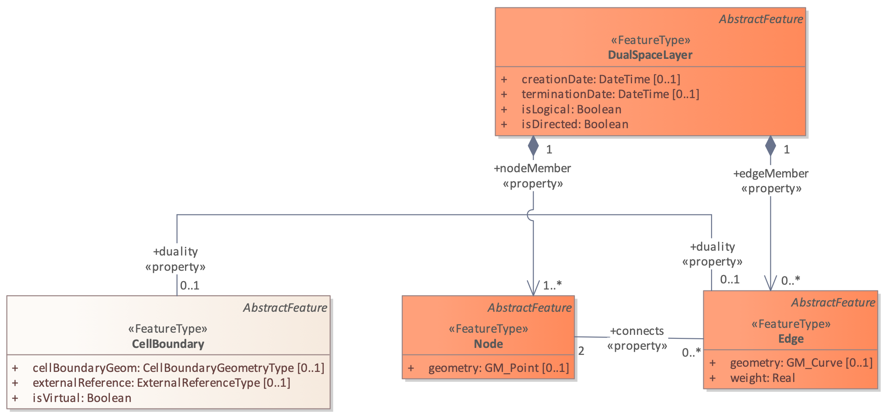
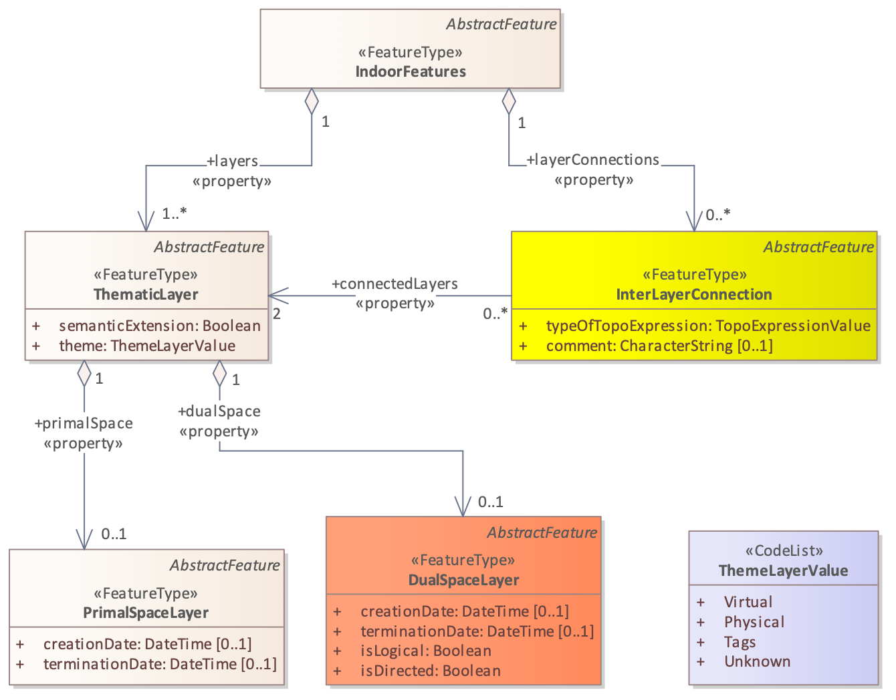
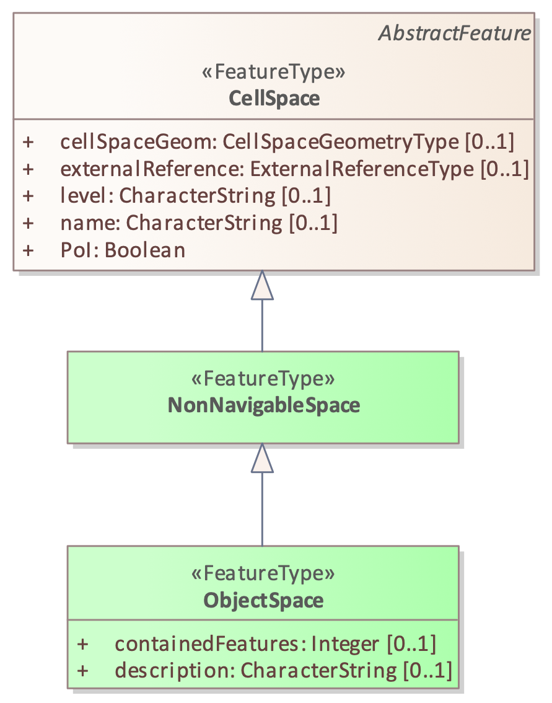

[[section-data-model]]
== Data Model

After explaining the important concepts on which IndoorGML relies, this section presents the conceptual data model using UML class diagram.

[[section-indoorgml-core]]
=== IndoorGML Core Module

The core module is composed of three main parts:

* the primal space which describes the cellular space (see <<section-cellularspace>>);
* the dual space which carries the network information (see <<section-poincareduality>>);
* the inter-layer connection which makes the link between thematic layers (see <<subsection-interlayerrelation>>).

In <<fig-uml-core-module>>, the UML diagram illustrates all the classes associated with those three parts.
In the following, the classes are introduced and the data types that they invoke in their attributes are detailed.

[[fig-uml-core-module]]
.UML diagram of the Core module
image::./figures/FIG16.png[align="center"]

[[subsection-cellspace]]
==== CellSpace

[[fig-uml-cellspace]]
.CellSpace and its related classes: PrimalSpaceLayer, CellBoundary, Node and InterLayerConnection
image::./figures/FIG17.png[align="center"]

CellSpace is a core module class for representing the environment in terms of cellular space.
CellSpace is a compulsory class to have a valid IndoorGML 2.0.
It contains the following attributes (<<fig-uml-cellspace>>):

* _cellSpaceGeom_ (_CellSpaceGeometryType_)
* _externalReference (url)_
* _level (CharacterString)_
* _name_ _(CharacterString)_
* _PoI (Boolean)_

The _cellSpaceGeom_ attribute carries an instance of type _CellSpaceGeometryType_ allowing the description of geometric representations of space.
A _CellSpaceGeometryType_ is a geometry class type with two possible attributes: _Geometry3D_ or _Geometry2D_.
They provide 3D and 2D description of a CellSpace instance.
The _Geometry3D_ attribute describes a representation of type solid, similar to the _GM_Solid_ (<<ISO_19107,ISO 19107>>) type.
It is the default type for describing a 3D CellSpace as one single valid entity.
The _Geometry2D_ attributes describe a representation of type surface, similar to the _GM_Surface_ type.
It is meant for describing a CellSpace in 2D as one single surface (in the case of a 2D IndooGML model).
The geometry should be valid according to the ISO 19107 standard terms.
If a CellSpace cannot meet those requirements, e.g., be valid 2D or 3D geometry, the option to describe its geometry as a set of CellBoundary entities can be considered.
The CellSpace can be defined without geometry as well.

The attribute _externalReference_ is used for the reference of an object to its corresponding object in an external data set.
A CellSpace also carries a _level_ information, which can be left empty when it cannot be clearly identified.
This is the case for example for a CellSpace that aggregates several cells spanning across multiple stories.
The value of _level_ is given as a string rather than an integer because it is sometime given as plain text "M" for mezzanine floor and "RC" for ground floor.
A newly introduced attribute is _name_.
This is destined to record the name given to a space according to any internal convention (e.g. MR.403 for meeting room 3 at level 4, or coverage of Wi-Fi 234).
This is a common practice for large buildings and this attribute helps simplifying space queries for applications.
Another new attribute _PoI_ is introduced to allow CellSpace elements to be flagged as Point of Interest for LBS applications.
The attribute is a simple Boolean allowing the implementation of special considerations for flagged cells.

Note that apart from the _PoI_ attribute, all applicable attributes of a CellSpace can be null.
For example, a network only IndoorGML model would not need a cellular space with explicit geometric description.
However, CellSpace instances should always be described in an IndoorGML model (even without geometry attribute) as they may carry all the important information related to the primal space that other features from the dual space or other layers may need (e.g. a node can be identified as a _PoI_ or associated with a _name_ thanks to the attribute of its primal space).

In terms of relationships, a CellSpace instance can describe relationship with multiple CellBoundary entities, which represent its surrounding boundaries partially or fully through the _boundedBy_ attribute.
For example, choice can be made to store only boundaries which are important for the Dual Graph (e.g., boundaries that reflect adjacency between CellSpaces).
In the case where a CellSpace does not carry the geometry of type Solid and uses a boundary-based representation instead, then all boundaries might be needed (to derive the geometry of the nodes or for visualisation).
Finally, with the _duality_ attribute, a CellSpace can describe a reference to one Node instance corresponding to its representation in the dual space.

CellSpace instances are aggregated in a PrimalSpaceLayer according to a specific theme as explained in <<section-thematiclayers>>.
In case of multiple PrimalSpaceLayers, the class InterLayerConnection establishes the link between the depended CellSpace instances.

[[subsection-cellboundary]]
==== CellBoundary

[[fig-uml-cellboundary]]
.CellBoundary and its related classed: PrimalSpaceLayer, CellSpace and Edge
image::./figures/FIG18.png[align="center"]

CellBoundary is a core module class to describe the boundary of each cell in a cellular space (<<fig-uml-cellboundary>>).
Unlike CellSpace, CellBoundary is not a compulsory class.
It is only required when Edge instances exist in the model.
It contains the following attributes:

* _cellBoundaryGeom (CellBoundaryGeometryType)_
* _externalReference (url)_
* _isVirtual (Boolean)_

The _cellBoundaryGeom_ geometry attribute of the CellBoundary carries the geometry (of type _CellBoundaryGeometryType_) which is generally described by a surface in 3D or a curve in 2D.
A _CellBoundaryGeometryType_ is a geometry class type similar to the _CellSpaceGeometryType_, with two possible attributes: _Geometry2D_ and _Geometry1D_.
The _Geometry2D_ attribute is the same than that of _CellSpaceGeometryType_.
Note, in this context, it is embedded in 3D, i.e., it has 3D coordinates and represents a part of the boundary of a CellSpace.
The _Geometry1D_ attribute describes a representation of type curve, GM_Curve type.
Note, it is meant it is intended for describing a CellBoundary in 2D as one single line/curve and has 2D coordinates.
This makes it adequate for representations based on 2D floor plans.
CellBoundaryGeom can be omitted. In this case, CellBoundaryGeom indicates only if a specific cell boundary is virtual.

The attribute _externalReference_ is used for the reference of a geometric object to its corresponding object in an external data set and can be given by the url of the file containing the geometry.
The _is_Virtual_ attribute is a Boolean value used to indicate whether a CellBoundary corresponds to a virtual surface (true) or a physical one (false), which should be the default value.
Virtual boundaries are common in 3D indoor models, mainly when a space subdivision is applied.

Additionally, a CellBoundary can be linked to one Edge instance via the _duality_ attribute, which corresponds to its dual representation.
Unlike CellSpace, it is not a mandatory class in an IndoorGML model.
In the case where there are CellSpace entities but no CellBoundary, the network should be derived from the cells using geometric operations.

In the case where there are CellBoundary entities provided without geometric attributes in the model, only logical networks can be safely derived between two CellSpace entities sharing any of those CellBoundary.
Therefore, providing geometric networks will still involve similar issues described previously.
A final scenario may see an IndoorGML model with geometry information only with CellBoundary instances but not for CellSpace.
That case is likely to happen if a solid geometry cannot be provided for a CellSpace, and a set of surface boundaries are provided with no guarantee of closure.
In that case the generation of a Node for a CellSpace should be completed from CellBoundary instances, while guaranteeing its position inside the described space.

[[subsection-primalspacelayer]]
==== PrimalSpaceLayer

[[fig-uml-primalspacelayer]]
.PrimalSpaceLayer and its related classes: CellSpace, CellBoundary and Thematic Layer
image::./figures/FIG19.png[align="center"]

PrimalSpaceLayer is a core module class representing the primal cellular spaces of a given thematic layer (<<fig-uml-primalspacelayer>>).
It aggregates CellSpace and CellBoundary (which are directly associated with their corresponding geometry attributes) to represent spatial objects in primal space.
The PrimalSpaceLayer class has the following attributes:

* _function (CodeList)_
* _creationDate (DateTime)_
* _terminationDate (DateTime)_

With the attribute _function_, nominal and real functions of a space layer are depending on the Thematic layer and can be described as proposed in a CodeList.
The _creationDate_ and _terminationDate_ attributes can be used to describe the chronology of the layer.
The points of time refer to real world times.

A PrimalSpaceLayer instance also provides references to its CellSpace and CellBoundary entities through the _cellSpaceMember_ and _cellBoundaryMember_ elements.

[[subsection-node]]
==== Node

[[fig-uml-node]]
.Node and its related classes: CellSpace, Edge, DualSpaceLayer and InterLayerConnection
image::./figures/FIG20.png[align="center"]

Node is a core module class to represent a node in dual space (<<fig-uml-node>>).
It has one attribute:

* _geometry (GM_Point)_

The value of _geometry_ corresponds to a 2D or 3D Point in IndoorGML, but its cardinality can be 0 (no geometry provided) or 1.
Because a Node is always the dual space abstraction of a primal space cell, it has always an association with its corresponding CellSpace (e.g., room, door, sensor coverage, etc.) through the _duality_ attribute.
This way, a Node can always access to the information related to the cell it is representing (e.g., geometry, semantic, etc.).
Note that the associated CellSpace may not carry any information as well, except the functional information for the specific cellular space.
Additionally, a Node is also associated with at least one Edge instance that is linked to it via the _connects_ attribute.

[[subsection-edge]]
==== Edge

[[fig-uml-edge]]
.Edge and its related classes: CellBoundary, Node and DualSpaceLayer

Edge is a core module class that represents the adjacency or connectivity relationships among Node elements representing space cells in primal space (<<fig-uml-edge>>).
It carries the following attributes:

* _geometry (GM_Curve)_
* _weight (real)_

The attribute _geometry_ provides the description of a 2D or 3D curve, but similarly to Node entities its cardinality can be 0 or 1 as well.
The attribute _weight_ can be used for graph-based applications (e.g., in order to deal with the impedance representing absolute barriers in transportation problems).

An Edge may be associated with a CellBoundary instance of the primary space via its _duality_ attribute.
This association can be skipped in situations where a CellBoundary is not necessary to represent the link between two CellSpace entities (e.g., for logical networks or visibility graphs where two CellSpaces connected by visibility may not share a CellBoundary).
Finally, an Edge always connects two Nodes.

[[subsection-dualspacelayer]]
==== DualSpaceLayer

[[fig-uml-dualspacelayer]]
.DualSpaceLayer and its related classes: Node, Edge and Thematic Layer
image::./figures/FIG22.png[align="center"]

DualSpaceLayer is a feature class for representing the dual space features (e.g., room network) of a given thematic layer.
It is composed of Nodes and Edges to represent the topology of objects from the primal space.
It has the following attributes:

* _isLogical_ (Boolean)
* _isDirected_ (Boolean)
* _creationDate (DateTime)_
* _terminationDate (DateTime)_

While _creationDate_ and _terminationDate_ are similar to those of PrimalSpaceLayer, the _isLogical_ attribute allows to differentiate whether the provided network is a geometric or a logical network.
This difference may matter for certain applications such as navigation, where a logical network would not be sufficient to evaluate travel distances between cells.
Similarly, the _isDirected_ attribute allows to specify if the graph associated with the DualSpaceLayer is directed or not.
A directed graph implies that the node directions should be considered in the applications.
Currently, the order of the nodes in the implementation formats determines their direction.
Additionally, a DualSpace provides references to all its related Node and Edge entities through its _nodeMember_ and _edgeMember_ attributes.

[[subsection-interlayerconnection]]
==== InterLayerConnection

[[fig-uml-interlayerconnection]]
.InterLayerConnection and its related classes: CellSpace, Node, ThematicLayer and IndoorFeatures

The InterLayerConnection class describes the connection between two layers in IndoorGML, either of type PrimalSpaceLayer or DualSpaceLayer (<<fig-uml-interlayerconnection>>).
It contains the following attributes:

* _typeOfTopoExpression (TopoExpressionValue)_
* _comment_ (CharacterString)

The _typeOfTopoExpression_ attribute represents the topological relationship between two layers.
It comes as a code list with the following values: _contains, within, covers, coveredBy, overlaps,_ and _equals_.
Those topological values are in the form of verbs for which the subject is the first instance of the _connectedLayers_ attribute.
In other words, for two layers successively described by the _connectedLayers_ attribute, e.g., Layer 1 and Layer 2, one should read Layer 1 _typeOfTopoExpression_ Layer 2 (e.g., Layer Room _contains_ Layer Furniture).

An InterLayerConnection also describes the cells or nodes that are connected between two layers, using the _connectedCells_ and/or _connectedNodes_ attributes.
The former is used when the connection is between two primal spaces and the latter is used otherwise.
Finally, the _comment_ attribute can contain an additional description for the InterLayerConnection.

[[subsection-tehmaticlayer]]
==== ThematicLayer

[[fig-uml-thematiclayer]]
.ThematicLayer and its related classes: PrimalSpaceLayer, DualSpaceLayer, InterLayerConnection and IndoorFeatures

The ThematicLayer is a core module class introduced in IndoorGML 2.0, as an aggregation of PrimalSpaceLayer and DualSpaceLayer instances to allow definition of Thematic layers separately (<<fig-uml-thematiclayer>>).
Note, <<OGC_19-011r4,IndoorGML 1.1>> enables the multi-layer mechanism only for the dual space (the networks).

The class comes with the following attributes:

* _semanticExtension_ (Boolean)
* _theme (ThemeLayerValue)_

The _semanticExtension_ attribute is set as a boolean as it is simply an indication that there is Extension module with additional semantic information associated to the PrimalSpaceLayer.
IndoorGML 2.0 maintains only the Navigation extension module (see <<section-indoorgml-navigation>>), a boolean is considered enough to indicate its presence.
This is however susceptible to evolve in the future (e.g., into a codeList).
The _theme_ attribute determines what type of representation of the model can be expected in the corresponding layer (e.g., topographic).
It comes in the form of a code list which tells whether the layer is of type Physical, Virtual, Tags or Unknown.

A _Physical_ layer is a layer that describes the indoor space on the basis of its physical constraints (e.g. the topographic cellular space in <<fig-cellular-space-same-physical>>).
It is the most common type of layers for applications like indoor navigation, where the physical elements are highly constraining the use of the space.
Similarly, a layer is qualified as _Virtual_ when its description of the space relies on exclusively virtual, or a combination of physical and virtual extents.
It is the case for example for functional spaces that can represent spaces necessary for some indoor objects to operate or to be used properly (<<diakite2018spatial,Diakité, 2018>>).
It is also the case for sensor spaces such as the Wi-Fi spaces represented in <<fig-cellular-space-same-physical>>.
Finally, the _Tags_ type is useful for describing layers that use symbols or tags to represent the cellular space.
It is a useful representation when the real geometry of the CellSpaces of a given layer are not relevant for a given application.
PoI are often represented in a separate layer with their locations only (e.g., in Dual Space).
Finally, any layer the does not fall in those previous categories will take the _Unknown_ type.

[[section-indoorgml-navigation]]
=== Navigation Extension Module

The Navigation extension module provides semantic information for indoor space to support indoor navigation applications (<<fig-uml-navigation-module>>).
The IndoorGML 2.0 semantics includes concepts related to navigability and connectivity between cells, obstacles and objects, as well as, routes for specific users.
Further specialisation of cell is made available by introducing attributes that can be used for additional navigation constraints such as temporal access related to as opening hours, or constraints resulting from properties of the navigation path.

[[fig-uml-navigation-module]]
.UML diagram of the Navigation Extension Module (classes in green)
image::./figures/FIG25.png[align="center"]

The space cells are classified into two major groups: _NavigableSpace_ and _NonNavigableSpace_.
NavigableSpace represents all indoor spaces (e.g., rooms, corridors, windows, stairs) that can be used by a navigation application.
Spaces connecting others are also considered by this class (e.g., openings).
NonNavigableSpace represents all indoor spaces that are not navigable, either because they are physically occupied by indoor features (e.g., furniture, walls) or because of other navigation constraints (e.g., accessibility).
Both NavigableSpace and NonNavigableSpace are child's classes of CellSpace.
<<fig-navigable-space>>.a illustrates such spaces on a 3D model.

NavigableBoundary and NonNavigableBoundary represents boundaries of NavigableSpace and NonNavigableSpace respectively.
They allow to describe the navigability of the spaces' sides.
For example, for the door space in <<fig-navigable-space>>.b, the sides that are meeting with the walls are of class NonNavigableBoundary, and the rest are NavigableBoundary.
They are child's classes of the CellBoundary class.
The association of CellSpace and CellBoundary classes with Node and Edge in IndoorGML core module ensures a link between the navigation module and the dual space.

[[fig-navigable-space]]
.a) Navigable and Non-navigable spaces and b) boundaries on a 3D model with walls and furniture (gray), indoor space (blue) and a door space (yellow).

[[subsection-navigablespace]]
==== NavigableSpace

[[fig-uml-navigablespace]]
.NavigableSpace and its related class: CellSpace
image::./figures/FIG27.png[align="center"]

The NavigableSpace class denotes a space in which users can move freely. It has two subclasses GeneralSpace and TransferSpace (<<fig-uml-navigablespace>>).
The subclasses are classified depending on the purpose of the space.
The compartmentalized spaces such as corridor, door, lobby, hallway, big room are represented as NavigableSpace.
Note, door is represented as NavigableSpace as shown in <<fig-navigable-space>> especially in 3D.
In 2D, doors are commonly represented as boundaries of rooms and have to be considered NavigableBoundaries (see <<subsection-navigableboundary>>)

NavigableSpace entities can carry information about the type of locomotion that they allow, through the _locomotionType_ attribute, which is one of the following values: _Flying, Rolling, Unspecified and Walking._
A Navigable space may handle one or several of the locomotion types listed.
Note, the class instances inherit the geometry of its parent CellSpace entity and can therefore be represented as gml:Solid on 3D data model or gml:Surface on 2D data model.

[[subsection-generalspace]]
==== GeneralSpace

[[fig-uml-generalspace]]
.General Space and its related class: NavigableSpace
image::./figures/FIG28.png[align="center"]

The GeneralSpace class is one of the two subclasses of NavigableSpace (<<fig-uml-generalspace>>).
GeneralSpace is identified as any navigable cells such as rooms, lobbies, kitchen, etc., which agents can use for a longer period of time and can serve as starting and target cell in navigation.
It carries the attribute _function_ which give details about the function of the cell.
In IndoorGML, those functions are described in a code list derived from OmniClass Table 13 (OmniClass, 2021) (see Annex B).
// TODO: OmniClass is described in Annex B?

[[subsection-transferspace]]
==== TransferSpace

[[fig-uml-transferspace]]
.Transfer Space and its related class: NavigableSpace
image::./figures/FIG29.png[align="center"]

The class TransferSpace is specialisation of NavigableSpace.
It is used to model a space that provide passages between GeneralSpaces.
Thereby, it typically describes openings (mainly doors but also windows) for horizontal transfer and entrances to staircase or lift cells for vertical transfers.
Similarly to the GeneralSpace class, it carries a _function_ attribute that is describes whether the space is an AnchorSpace (a space allowing to connect the indoor and the outdoor) or a BoundarySpace (a space connecting two indoor or two outdoor spaces).
Another of its attribute is _type_ which specified through a codeList the TransferSpaceType (Door or Window).

[[subsection-navigableboundary]]
==== NavigableBoundary

[[fig-uml-navigableboundary]]
.Navigable Boundary and its related class: CellBoundary
image::./figures/FIG30.png[align="center"]

The NavigableBoundary class is a specialisation of a CellBoundary and provides further information related to NavigableSpace (<<fig-uml-navigableboundary>>).
As illustrated in <<fig-navigable-space>>, it typically represents the space boundaries that correspond to entrances or exits through which agents navigate from one cell to another.
It is therefore mainly found between GeneralSpace and TransferSpace cells but can happen between two GeneralSpace cells as well (e.g., in the case of a room subdivided to distinguish areas of different purposes).

A NavigableSpace is necessarily bound by at least one NavigableBoundary.
In the specific case of a TransferSpace, it is expected to have at least two NavigableBoundary instances bound to it, as a TransferSpace serve for transition between connected spaces.

The class carries a _boundaryOrientation_ attribute and a _navigableBoundaryFunction_ attribute specifying if the boundary is an _AnchorBoundary_ or a _ConnectionBoundary_ (see <<subsection-transferspace>> for more details).

[[subsection-nonnavigablespace]]
==== NonNavigableSpace

[[fig-uml-nonnavigablespace]]
.NonNavigableSpace its related class: CellSpace

The NonNavigableSpace class represents cells that are occupied by obstacles (<<fig-uml-nonnavigablespace>>).
It can correspond to the structural elements of a building (walls, slabs, etc.) or other indoor features populating the space (furniture, appliances etc.).
It is a class without attributes, but opens options to classify further the non-navigable cells.

[[subsection-obejctspace]]
==== ObjectSpace

[[fig-uml-objectspace]]
.ObjectSpace and its related class: NonNavigableSpace
image::./figures/FIG32.png[align="center"]

The ObjectSpace (<<fig-uml-objectspace>>) class is meant to bring additional details to a NonNavigableSpace when it contains some objects that makes it non-navigable.
The class has two attributes:

* _containedFeatures (Integer),_ and
* _description (CharacterString)._

The _containedFeatures_ attribute is an integer that describes the number of objects encapsulated within the ObjectSpace and thus, by extension within the parent NonNavigableSpace.
The objects in question can be represented in a different layer of the model and the link to the corresponding ObjectSpace can be made through an InterLayerConnection instance with a _within_ or _contains_ relationship.
The _description_ attribute is meant to provide any relevant information regarding the objects contained within the space in plain text.

[[subsection-nonnavigableboundary]]
==== NonNavigableBoundary

[[fig-uml-nonnavigableboundary]]
.NonNavigableBoundary and its related classes: CellBoundary
image::./figures/FIG33.png[align="center"]

NonNavigableBoundary entities represent the boundaries between two NonNavigableSpace cells or between a NavigableSpace and a NonNavigableSpace cells (<<fig-uml-nonnavigableboundary>>).
As such, it is the type of boundary that can be found typically at the lateral sides of a TransferSpace (see <<fig-navigable-space>>.b), corresponding for example to the walls surrounding a door.

[[subsection-route]]
==== Route
[[fig-uml-route]]
.Route and its related classes: Node and Edge
image::./figures/FIG34.png[align="center"]

The Route class is a specialisation of a Dual space that represents a subset of Network (logical or physical), which includes a path to navigate through indoor space.
It is usually defined as the result of a path finding query.

It has the one attribute which is _creationDate._
Because dynamic indoor environment may imply change in space availability and accessibility, a path at a given time may not be suitable anymore at another time.
For this reason, the _creationDate_ attribute helps indicating at which time a given route was created.
The _routeNode_ and _routeEdge_ attributes are both ordered sequences of Node and Edge references to describe the different parts of the route path.
Therefore, the first and last _routeNode_ elements correspond respectively to the starting and destination points of the route.