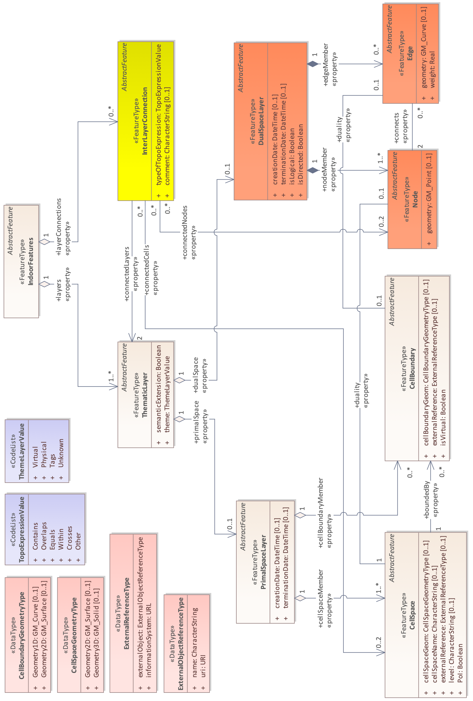
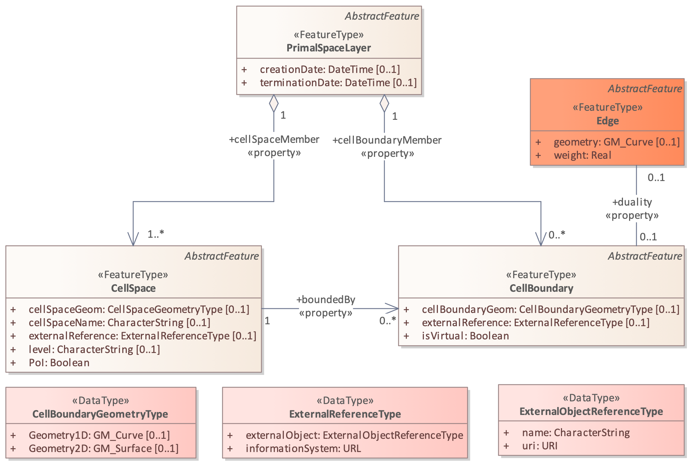
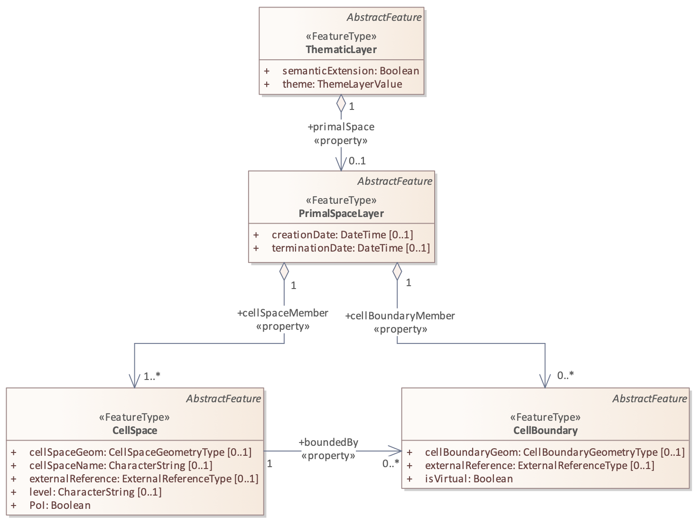
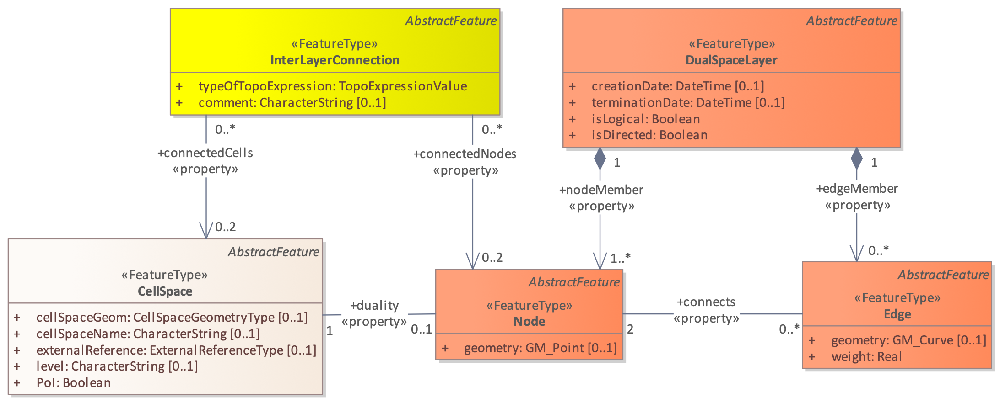
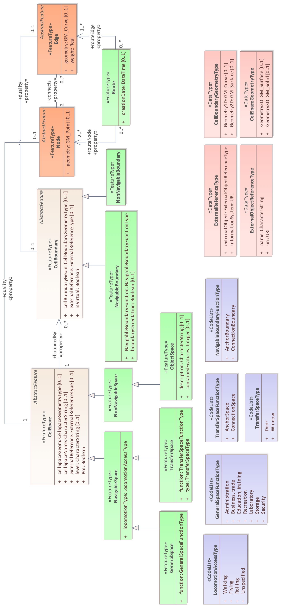
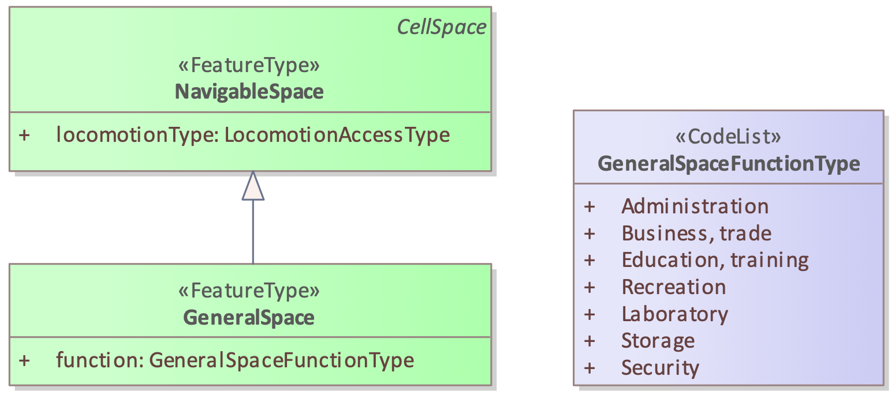
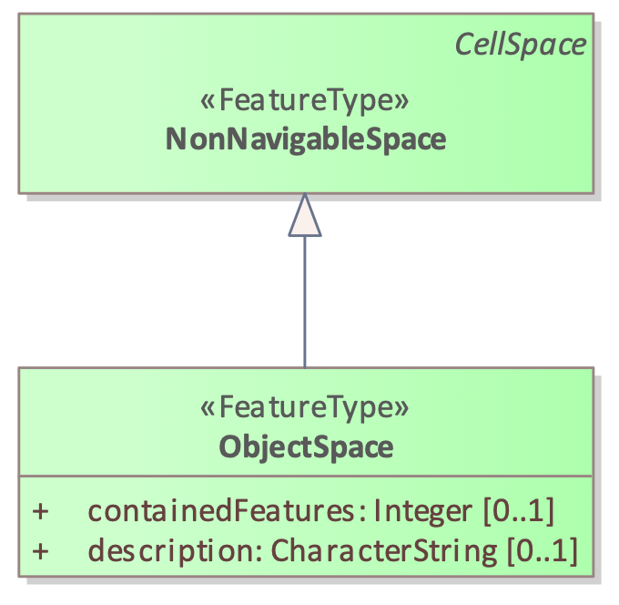

[[section-data-model]]
== Data Model

This section presents the IndoorGML conceptual data model as UML class diagrams.

[[section-indoorgml-core]]
=== IndoorGML Core Module

The core module is composed of three main parts:

* The primal space which describes the cellular space (see <<section-cellularspace>>);
* The dual space which carries the network information (see <<section-poincareduality>>);
* The inter-layer connection which makes the link between thematic layers (see <<subsection-interlayerrelation>>).

In <<fig-uml-core-module>>, the UML diagram illustrates all the classes associated with those three parts.
In the following, the classes are introduced and the data types that they invoke in their properties are detailed.

[[fig-uml-core-module]]
.UML diagram of the Core module.

[[subsection-cellspace]]
==== CellSpace

CellSpace is a core module class for representing the indoor environment in terms of cellular space.
CellSpace is a mandatory class to have a valid IndoorGML2.0 encoding.
It contains the following properties (<<fig-uml-cellspace>>):

* _cellSpaceGeom (CellSpaceGeometryType)_
* _cellSpaceName (CharacterString)_
* _externalReference (ExternalReferenceType)_
* _level (CharacterString)_
* _PoI (Boolean)_

[[fig-uml-cellspace]]
.CellSpace and its related classes: PrimalSpaceLayer, CellBoundary, Node and InterLayerConnection

The _cellSpaceGeom_ property carries an instance of type _CellSpaceGeometryType_ for the description of geometric representations of space.
A _CellSpaceGeometryType_ is a geometry class type with two possible properties: _Geometry3D_ or _Geometry2D_.
They provide the 3D and 2D description of a CellSpace instance.
The _Geometry3D_ property describes a representation of type solid, similar to the _GM_Solid_ (<<ISO_19107,ISO 19107>>) type.
It is the default type for describing a 3D CellSpace as one single valid entity.
The _Geometry2D_ property describes a representation of type surface, similar to the _GM_Surface_ type.
This property describes a CellSpace in 2D as one single surface (in the case of a 2D IndoorGML model).
The geometry should be valid according to the ISO 19107 Standard terms.
If a CellSpace cannot meet those requirements, e.g., be valid 2D or 3D geometry, the option to describe its geometry as a set of CellBoundary entities can be considered.
The CellSpace can be defined without geometry as well.

The property _externalReference_ is used for the reference of an object to its corresponding object in an external data set.
A CellSpace also carries a _level_ information, which can be left empty when it cannot be clearly identified.
For example, this is the case for a CellSpace that aggregates several cells spanning across multiple stories.
The value of _level_ is given as a string rather than an integer because it is sometime given as plain text “M” for mezzanine floor and “RC” for ground floor.
A newly introduced property in IndoorGML 2 is _cellSpaceName_.
The purpose is to record the name given to a space according to any internal convention (e.g., MR.403 for meeting room 3 at level 4, or coverage of Wi-Fi 234).
This is a common practice for large buildings and this property helps simplify space queries for applications.
Another new property _PoI_ is introduced to allow CellSpace elements to be flagged as Point of Interest for LBS applications.
The property is a simple Boolean allowing the implementation of special considerations for flagged cells.

Note that apart from the _PoI_ property, all applicable properties of a CellSpace can be null.
For example, a network only IndoorGML model would not need a cellular space with explicit geometric description.
However, CellSpace instances should always be described in an IndoorGML model (even without geometry property) as they may carry all the important information related to the primal space that other features from the dual space or other layers may need.
For example, a node can be identified as a _PoI_ or associated with a _cellSpaceName_ thanks to the property of its primal space.

In terms of relationships, a CellSpace instance can describe relationship with multiple CellBoundary entities, which represent its surrounding boundaries partially or fully through the _boundedBy_ association.
For example, the choice can be made to store only boundaries which are important for the Dual Graph (e.g., boundaries that reflect adjacency between CellSpaces).
In the case where a CellSpace does not carry the geometry of type Solid and uses a boundary-based representation instead, then all boundaries might be needed (to derive the geometry of the nodes or for visualization).
Finally, with the _duality_ association, a CellSpace can describe a reference to one Node instance corresponding to its representation in the dual space.

CellSpace instances are aggregated in a PrimalSpaceLayer according to a specific theme as explained in <<section-thematiclayers>>.
For the case of multiple PrimalSpaceLayers, the class InterLayerConnection establishes the link between the depended CellSpace instances.

[[subsection-cellboundary]]
==== CellBoundary

CellBoundary is a core module class that describes the boundary of each cell in a cellular space (<<fig-uml-cellboundary>>).
Unlike CellSpace, CellBoundary is not a compulsory class.
It is only required when Edge instances exist in the model.
CellBoundary contains the following properties:

* _cellBoundaryGeom (CellBoundaryGeometryType)_
* _externalReference (ExternalReferenceType)_
* _isVirtual (Boolean)_

[[fig-uml-cellboundary]]
.CellBoundary and its related classed: PrimalSpaceLayer, CellSpace and Edge

The _cellBoundaryGeom_ geometry property of the CellBoundary carries the geometry (of type _CellBoundaryGeometryType_) which is generally described by a surface in 3D or a curve in 2D.
A _CellBoundaryGeometryType_ is a geometry class type similar to the _CellSpaceGeometryType_, with two possible properties: _Geometry2D_ and _Geometry1D_.
The _Geometry2D_ property is the same as that of _CellSpaceGeometryType_.
Note, in this context, _cellBoundaryGeom_ is embedded in 3D, i.e., has 3D coordinates and represents a part of the boundary of a CellSpace.
The _Geometry1D_ property describes a representation of type curve, _GM_Curve_ type.
Note, this property is intended for describing a CellBoundary in 2D as one single line/curve and has 2D coordinates.
This is an adequate representation of _cellBoundaryGeom_ based on 2D floor plans.
_cellBoundaryGeom_ is not required (e.g., when CellBoundary simply indicates a virtual boundary).

The property _externalReference_ is used for the reference of a geometric object to its corresponding object in an external data set and can be given by the url of the file containing the geometry.
The _isVirtual_ property is a Boolean value used to indicate whether a CellBoundary corresponds to a virtual surface (true) or a physical one (false), which should be the default value.
Virtual boundaries are common in 3D indoor models, mainly when a space subdivision is applied.

Additionally, a CellBoundary can be linked to one Edge instance via the _duality_ association, which corresponds to its dual representation.
Unlike CellSpace, CellBoundary is not a mandatory instance in an IndoorGML data.
In the case where there are CellSpace entities but no CellBoundary, the network may be derived from the cells using geometric operations.

In the case where there are CellBoundary entities provided without geometric properties in the model, only logical networks can be safely derived between two CellSpace entities sharing any of those CellBoundary.
Therefore, providing geometric networks involves similar issues described previously.
A final scenario may see an IndoorGML data with geometry information only with CellBoundary instances but not for CellSpace.
That case is likely to happen if a solid geometry cannot be provided for a CellSpace, and a set of surface boundaries are provided with no guarantee of closure.
In that case the generation of a Node for a CellSpace should be completed from CellBoundary instances, while guaranteeing its position inside the described space.

[[subsection-primalspacelayer]]
==== PrimalSpaceLayer

PrimalSpaceLayer is a core module class representing the primal cellular spaces of a given thematic layer (<<fig-uml-primalspacelayer>>).
It aggregates CellSpace and CellBoundary (which are directly associated with their corresponding geometry properties) to represent spatial objects in primal space.
The PrimalSpaceLayer class has the following properties:

* _creationDate (DateTime)_
* _terminationDate (DateTime)_

[[fig-uml-primalspacelayer]]
.PrimalSpaceLayer and its related classes: CellSpace, CellBoundary and Thematic Layer

Both _creationDate_ and _terminationDate_ properties can be used to describe the chronology of the layer.
A PrimalSpaceLayer instance also provides references to its CellSpace and CellBoundary entities through the _cellSpaceMember_ and _cellBoundaryMember_ elements.

[[subsection-node]]
==== Node

Node is a core module class for representing a node in dual space (<<fig-uml-node>>).
It has one property:

* _geometry (GM_Point)_

[[fig-uml-node]]
.Node and its related classes: CellSpace, Edge, DualSpaceLayer and InterLayerConnection

The value of _geometry_ corresponds to a 2D or 3D Point in the IndoorGML model, but its cardinality can be 0 (no geometry provided) or 1.
Because a Node is always the dual space abstraction of a primal space cell, a Node always has an association with its corresponding CellSpace (e.g., room, door, sensor coverage, etc.) through the _duality_ association.
This way, a Node can always access the information related to the cell it is representing (e.g., geometry, semantic, etc.).
Note that the associated CellSpace may not carry any information as well, except the functional information for the specific cellular space.
Additionally, a Node is also associated with at least one Edge instance that is linked to it via the _connects_ association.

[[subsection-edge]]
==== Edge

Edge is a core module class that represents the adjacency or connectivity relationships among Node elements representing space cells in primal space (<<fig-uml-edge>>).
The Edge class has the following properties:

* _geometry (GM_Curve)_
* _weight (Real)_

[[fig-uml-edge]]
.Edge and its related classes: CellBoundary, Node and DualSpaceLayer
image::./figures/FIG21.png[align="center"]

The property _geometry_ provides the description of a 2D or 3D curve, but similar to Node entities its cardinality can be 0 or 1 as well.
The property _weight_ can be used for graph-based applications such as dealing with the impedance representing absolute barriers in transportation problems.

An Edge may be associated with a CellBoundary instance of the primary space via its _duality_ association.
This association can be skipped in situations where a CellBoundary is not necessary to represent the link between two CellSpace entities.
For example, logical networks or visibility graphs where two CellSpaces connected by visibility may not share a CellBoundary.
Finally, an Edge always connects two Nodes.

[[subsection-dualspacelayer]]
==== DualSpaceLayer

DualSpaceLayer is a feature class for representing the dual space features (e.g., room network) of a given thematic layer.
The DualSpaceLayer class is composed of Nodes and Edges for representing the topology of objects from the primal space.
It has the following properties:

* _creationDate (DateTime)_
* _terminationDate (DateTime)_
* _isLogical (Boolean)_
* _isDirected (Boolean)_

[[fig-uml-dualspacelayer]]
.DualSpaceLayer and its related classes: Node, Edge and Thematic Layer

While _creationDate_ and _terminationDate_ are similar to those of PrimalSpaceLayer, the _isLogical_ property allows differentiating whether the provided network is a geometric or a logical network.
This difference may matter for certain applications such as navigation, where a logical network would not be sufficient to evaluate travel distances between cells.
Similarly, the _isDirected_ property allows to specify if the graph associated with the DualSpaceLayer is directed or not.
A directed graph implies that the node directions should be considered in the applications.
Currently, the order of the nodes in the implementation formats determines their direction.
Additionally, a DualSpace provides references to all its related Node and Edge entities through its _nodeMember_ and _edgeMember_ compositions.

[[subsection-interlayerconnection]]
==== InterLayerConnection

The InterLayerConnection class describes the connection between two layers in IndoorGML, either of type PrimalSpaceLayer or DualSpaceLayer (<<fig-uml-interlayerconnection>>).
The InterLayerConnection class contains the following properties:

* _typeOfTopoExpression (TopoExpressionValue)_
* _comment (CharacterString)_

[[fig-uml-interlayerconnection]]
.InterLayerConnection and its related classes: CellSpace, Node, ThematicLayer and IndoorFeatures
image::./figures/FIG23.png[align="center"]

The _typeOfTopoExpression_ property represents the topological relationship between two layers.
_typeOfTopoExpression_ is a code list with the following values: _contains, within, crosses, overlaps_ and _equals_.
Those topological values are in the form of verbs for which the subject is the first instance of the _connectedLayers_ property.
In other words, for two layers successively described by the _connectedLayers_ association, such as Layer 1 and Layer 2, one should read Layer 1 _typeOfTopoExpression_ Layer 2 (e.g., Layer Room _contains_ Layer Furniture).

An InterLayerConnection also describes the cells or nodes that are connected between two layers, using the _connectedCells_ and/or _connectedNodes_ associations.
The former is used when the connection is between two primal spaces and the latter is used otherwise.
Finally, the _comment_ property can contain an additional description for the InterLayerConnection.

[[subsection-tehmaticlayer]]
==== ThematicLayer

The ThematicLayer is a core module class introduced in IndoorGML2.0.
ThematicLayer is an aggregation of PrimalSpaceLayer and DualSpaceLayer instances to allow definition of Thematic layers separately (<<fig-uml-thematiclayer>>).
Note, <<OGC_19-011r4,IndoorGML 1.1>> enables the multi-layer mechanism only for the dual space (the networks).

The ThematicLayer class is composed of the following properties:

* _semanticExtension (Boolean)_
* _theme (ThemeLayerValue)_

[[fig-uml-thematiclayer]]
.ThematicLayer and its related classes: PrimalSpaceLayer, DualSpaceLayer, InterLayerConnection and IndoorFeatures
image::./figures/FIG24.png[align="center"]

The _semanticExtension_ property is a Boolean that indicates whether there is Extension module with additional semantic information associated to the PrimalSpaceLayer.
The IndoorGML 2.0 Standard only specifies the Navigation extension module (see <<section-indoorgml-navigation>>).
The use of a Boolean is considered enough to indicate the presence of the Navigation extension.
However, this is expected to evolve in the future (into a codeList).
The _theme_ property determines what type of representation of the model can be expected in the corresponding layer (e.g topographic).
The _theme_ property comes in the form of a code list which tells whether the layer is of type _Physical, Virtual, Tags_ or _Unknown_.

A _Physical_ layer is a layer that describes the indoor space on the basis of its physical constraints (e.g., the topographic cellular space in <<fig-cellular-space-same-physical>>) (<<nagel2009multilayered, Nagel et al., 2009>>).
It is the most common type of layer for applications such as indoor navigation, where the physical elements highly constrain the use of the space.
Similarly, a layer is qualified as _Virtual_ when its description of the space relies exclusively on virtual, or a combination of physical and virtual extents.
For example, the case for functional spaces that can represent spaces necessary for some indoor objects to operate or to be used properly (<<diakite2018spatial,Diakité, 2018>>).
This is also the case for sensor spaces such as the Wi-Fi spaces represented in <<fig-cellular-space-same-physical>>.
Finally, the _Tags_ type is useful for describing layers that use symbols or tags to represent the cellular space.
The _Tags_ type is a useful representation when the real geometry of the CellSpaces of a given layer are not relevant for a given application.
PoI are often represented in a separate layer with their locations only (e.g., in Dual Space).
Finally, any layer the does not fall in those previous categories will take the _Unknown_ type.

[[section-indoorgml-navigation]]
=== Navigation Extension Module

The Navigation extension module provides semantic information for indoor space to support indoor navigation applications (<<fig-uml-navigation-module>>).
The IndoorGML 2.0 semantics includes concepts related to navigability and connectivity between cells, obstacles and objects, as well as, routes for specific users.
Further specialisation of cell is made available by introducing properties that can be used for additional navigation constraints such as temporal access related to as opening hours, or constraints resulting from properties of the navigation path.

[[fig-uml-navigation-module]]
.UML diagram of the Navigation Extension Module (classes in green)

The space cells are classified into two major groups: _NavigableSpace_ and _NonNavigableSpace_.
NavigableSpace represents all indoor spaces (e.g., rooms, corridors, windows, stairs) that can be used by a navigation application.
Spaces connecting others are also considered by this class (such as openings).
NonNavigableSpace represents all indoor spaces that are not navigable, either because they are physically occupied by indoor features (such as furniture or walls) or because of other navigation constraints (e.g., accessibility).
Both NavigableSpace and NonNavigableSpace are child’s classes of CellSpace.
<<fig-navigable-space>>(a) illustrates such spaces on a 3D model.

NavigableBoundary and NonNavigableBoundary represents boundaries of NavigableSpace and NonNavigableSpace respectively.
They are for describing the navigability of the spaces’ sides.
For example, for the door space in <<fig-navigable-space>>(b), the sides that are meeting with the walls are of class NonNavigableBoundary, and the rest are NavigableBoundary.
They are child’s classes of the CellBoundary class.
The association of CellSpace and CellBoundary classes with Node and Edge in IndoorGML core module ensures a link between the navigation module and the dual space.

[[fig-navigable-space]]
.Navigable and Non-navigable spaces (a) and boundaries (b) on a 3D model with walls and furniture (grey), indoor space (blue) and a door space (yellow).
image::./figures/FIG26.png[align="center"]

[[subsection-navigablespace]]
==== NavigableSpace

The NavigableSpace class denotes a space in which users can move freely.
It has two subclasses GeneralSpace and TransferSpace (<<fig-uml-navigablespace>>).
The subclasses are classified depending on the purpose of the space.
The compartmentalized spaces such as corridor, door, lobby, hallway, big room are represented as NavigableSpace.
Note, door is represented as NavigableSpace as shown in <<fig-navigable-space>>, especially in the 3D case.
In 2D, doors are commonly represented as boundaries of rooms and must be considered NavigableBoundaries (see <<subsection-navigableboundary>>)

[[fig-uml-navigablespace]]
.NavigableSpace and its related class: CellSpace

NavigableSpace entities can carry information about the type of locomotion, which is the allowed transportation mode in indoor space.
The _locomotionType_ property has one of the following values: _Walking, Flying, Rolling_ and _Unspecified_.
A Navigable space may handle one or several of the locomotion types listed. Note,
the class instances inherit the geometry of its parent CellSpace entity and can therefore be represented as GM_Solid on 3D data model or GM_Surface on 2D data model.

[[subsection-generalspace]]
==== GeneralSpace

The GeneralSpace class is one of the two subclasses of NavigableSpace (<<fig-uml-generalspace>>).
GeneralSpace is identified as any navigable cells such as rooms, lobbies, kitchen, etc., which agents can use for a longer period of time and can serve as starting and target cell in navigation.
It carries the property _function_ which specifies details about the function of the cell.
// In IndoorGML, those functions are described in a code list derived from OmniClass Table 13 (OmniClass, 2021)

[[fig-uml-generalspace]]
.GeneralSpace and its related class: NavigableSpace

[[subsection-transferspace]]
==== TransferSpace

The class TransferSpace is specialization of NavigableSpace.
It is used to model a space that provides passages between GeneralSpaces.
Thereby, it typically describes openings (mainly doors but also windows) for horizontal transfer and entrances to staircase or lift cells for vertical transfers.
Similarly to the GeneralSpace class, TransferSpace carries a _function_ property that describes whether the space is an AnchorSpace (a space allowing to connect the indoor and the outdoor) or a BoundarySpace (a space connecting two indoor or two outdoor spaces).
Another of its property is _type_ which specified through a codeList the TransferSpaceType (Door or Window).

[[fig-uml-transferspace]]
.TransferSpace and its related class: NavigableSpace
image::./figures/FIG29.png[width=400px, align="center"]

[[subsection-navigableboundary]]
==== NavigableBoundary

The NavigableBoundary class is a specialization of a CellBoundary and provides further information related to NavigableSpace (<<fig-uml-navigableboundary>>).
As illustrated in <<fig-navigable-space>>, it typically represents the space boundaries that correspond to entrances or exits through which agents navigate from one cell to another.
The NavigableBoundary class is therefore mainly found between GeneralSpace and TransferSpace cells but can happen between two GeneralSpace cells as well such as in the case of a room subdivided to distinguish areas of different purposes.

A NavigableSpace is necessarily bound by at least one NavigableBoundary.
In the specific case of a TransferSpace, it is expected to have at least two NavigableBoundary instances bound to it, as a TransferSpace serves for transition between connected spaces.

The class carries a _boundaryOrientation_ property and a _navigableBoundaryFunction_ property specifying if the boundary is an _AnchorBoundary_ or a _ConnectionBoundary_ (see <<subsection-transferspace>> for more details).

[[fig-uml-navigableboundary]]
.NavigableBoundary and its related class: CellBoundary

[[subsection-nonnavigablespace]]
==== NonNavigableSpace

The NonNavigableSpace class represents cells that are occupied by obstacles (<<fig-uml-nonnavigablespace>>).
It can correspond to the structural elements of a building (walls, slabs, etc.) or other indoor features populating the space (furniture, appliances etc.).
NonNavigableSpace is a class without properties, but allows options to further classify non-navigable cells.

[[fig-uml-nonnavigablespace]]
.NonNavigableSpace its related class: CellSpace
image::./figures/FIG31.png[width=300px, align="center"]

[[subsection-obejctspace]]
==== ObjectSpace

The ObjectSpace (<<fig-uml-objectspace>>) class is meant to bring additional details to a NonNavigableSpace when it contains some objects that makes it non-navigable.
The class has two properties: _containedFeatures (Integer)_, and _description (CharacterString)_.

[[fig-uml-objectspace]]
.ObjectSpace and its related class: NonNavigableSpace

The _containedFeatures_ property is an integer that describes the number of objects encapsulated within the ObjectSpace and thus, by extension within the parent NonNavigableSpace.
The objects in question can be represented in a different layer of the model and the link to the corresponding ObjectSpace can be made through an InterLayerConnection instance with a _within_ or _contains_ relationship.
The _description_ property is meant to provide any relevant information regarding the objects contained within the space in plain text.

[[subsection-nonnavigableboundary]]
==== NonNavigableBoundary

NonNavigableBoundary entities represent the boundaries between two NonNavigableSpace cells or between a NavigableSpace and a NonNavigableSpace cells (<<fig-uml-nonnavigableboundary>>).
As such, it is the type of boundary that can be found typically at the lateral sides of a TransferSpace (see <<fig-navigable-space>>(b)), corresponding for example to the walls surrounding a door.

[[fig-uml-nonnavigableboundary]]
.NonNavigableBoundary and its related classes: CellBoundary

[[subsection-route]]
==== Route

The Route class is a specialization of a Dual space that represents a subset of Network (logical or physical), which includes a path to navigate through indoor space.
It is usually defined as the result of a path finding query.

The Route class has one property: _creationDate_.
Because dynamic indoor environments may imply change in space availability and accessibility, a suitable path at a given time may not be suitable at another time.
For this reason, the _creationDate_ property helps indicating at which time a given route was created.
The _routeNode_ and _routeEdge_ properties are both ordered sequences of Node and Edge references to describe the different parts of the route path.
Therefore, the first and last _routeNode_ elements correspond respectively to the starting and destination points of the route.

[[fig-uml-route]]
.Route and its related classes: Node and Edge

=== Requirements

In this subsection, the requirements for implementing IndoorGML Part 1 – Conceptual Model are defined.
The implementation of IndoorGML Part I SHALL be in conformance with the requirements given in the list below.

[requirements_class]
====
[%metadata]
identifier:: http://www.opengis.net/spec/indoorgml/2.0/req
subject:: Implementation Specification
// inherit::
requirement:: /req/umlclassdiagram
requirement:: /req/thematiclayer
requirement:: /req/cellspace
requirement:: /req/cellboundary
requirement:: /req/node
requirement:: /req/edge
requirement:: /req/interlayerconnection
requirement:: /req/objectspace
====

[[req-umlclassdiagram]]
[requirement]
.UML Class Diagram
====
[%metadata]
identifier:: /req/umlclassdiagram
part:: The Implementation Specification SHALL contain or represents the same concepts as defined in the UML class diagram – +
--
* Contain elements which represent the same concept as that defined for the UML class,
* Represent associations of the UML classes and their superclasses with the same source, target, direction, roles, and multiplicities, and
* Contain the attributes of the classes and their superclasses with the same name, definition, type, code list, and multiplicity.
--
====

[[req-thematiclayer]]
[requirement]
.Thematic Layer
====
[%metadata]
identifier:: /req/thematiclayer
part:: Any feature of a thematic layer SHALL belong to the same theme.
====

[[req-cellspace]]
[requirement]
.Cell Space
====
[%metadata]
identifier:: /req/cellspace
part:: Cells belonging to the same primal space layer SHALL not intersect with each other.
====

[[req-cellboundary]]
[requirement]
.Cell Boundary
====
[%metadata]
identifier:: /req/cellboundary
part:: Cell boundaries belonging to the same primal space layer SHALL not intersect.
part:: The geometry of cell boundary SHALL not exceed the extent of the corresponding cell space.
====

[[req-node]]
[requirement]
.Node
====
[%metadata]
identifier:: /req/node
part:: When the isLogical property of a DualSpaceLayer is set to FALSE, the geometries of its Node instances SHALL be spatially located inside of their corresponding CellSpaces.
====

[[req-edge]]
[requirement]
.Edge
====
[%metadata]
identifier:: /req/edge
part:: No self-intersection is allowed when its geometry is given.
part:: If dualspaceLayer.directed=true, then the order of nodes represents the direction.
====

[[req-interlayerconnection]]
[requirement]
.Interlayer Connection
====
[%metadata]
identifier:: /req/interlayerconnection
part:: Two target cell spaces (or nodes) SHALL not belong to a same primal space layer (or dual space layer).
part:: Connected nodes or connected cells SHALL be consistent with connected layers. This means that the target cell spaces (or nodes) SHALL belong to primal space layer (or dual space layer) of the connected layer.
part:: The cardinalities of Node (connectedNodes property) and CellSpace (connectedCells property) SHALL either be 0 or 2 but can never be 1.
part:: Two connectedNodes are not commutative. For example, "node _A_ contains node B” does not mean “node _B_ contains node A”.
====

[[req-objectspace]]
[requirement]
.ObjectSpace
====
[%metadata]
identifier:: /req/objectspace
part:: ObjectSpace instances also fall under the non-overlapping constraint of CellSpaces. As such, they SHOULD not overlap with any other CellSpace or its specialized classes. Therefore, ObjectSpace can either be carved out of the space containing them or they can be defined in different layers (to avoid complex Boolean operations for example).
====
//
// [[req-route]]
// [requirement]
// ====
// [%metadata]
// identifier:: /req/navigation/route
// part:: Self-intersection shall not be allowed.
// ====