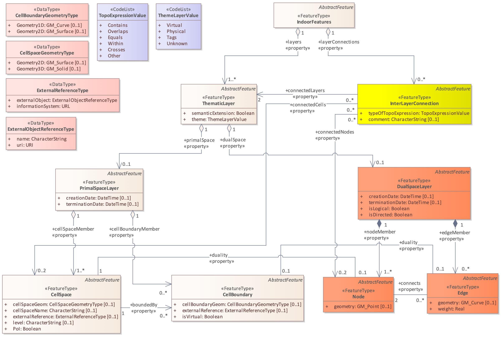
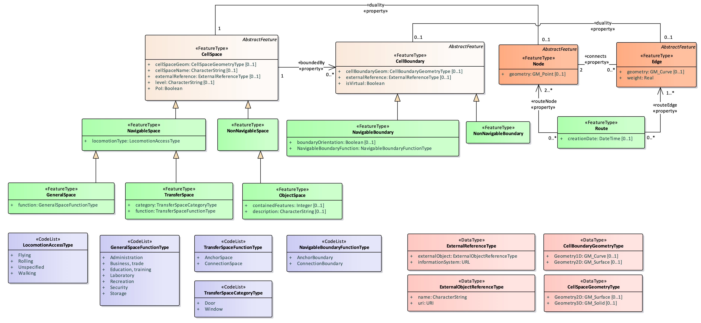

== Overview of the SQL Encoding

The SQL encoding of IndoorGML 2.0 implements the conceptual classes of <<ogc22-045r5,IndoorGML 2.0 Part 1>> as relational database tables.
The conceptual model remains normative for semantics, while this document defines the SQL representation.

=== Design Principle

The SQL encoding is based on the following encoding principles.

==== Conceptual model preservation

The SQL encoding of the IndoorGML core module preserves the IndoorGML 2.0 core conceptual model structure, as shown in the below figure.

[[fig-core-indoorgml]]
.IndoorGML 2.0 core module structure

The core SQL encoding schema follows <<fig-core-indoorgml>>.
Each feature class is mapped to one or more relational tables, and associations are represented using foreign key columns or junction tables.
For example, the `Indoorfeatures` table is related to `Thematiclayer` rows through the `IndoorfeaturesID` foreign key, and `Interlayerconnection` rows are linked to `Thematiclayer`, `Node`, and `Cellspace` rows through the `InterLayerConnection_ThematicLayer`, `InterLayerConnection_Node`, and `InterLayerConnection_CellSpace` junction tables.

The SQL encoding of the IndoorGML navigation module preserves the IndoorGML 2.0 navigation conceptual model structure, as shown in the below figure.

[[fig-navi-indoorgml]]
.IndoorGML 2.0 navigation module structure

The navigation SQL encoding schema follows <<fig-navi-indoorgml>>.
Navigation feature classes extend core tables using table inheritance patterns implemented through foreign key references to `Cellspace` and `Cellboundary`.

==== UML-to-SQL generation workflow

The SQL encoding schema is derived from the IndoorGML 2.0 UML model and is designed on the basis of PostgreSQL with PostGIS as the reference database platform.
SQL `CREATE TABLE` statements are first generated from the UML model using Enterprise Architecture tooling, and the resulting DDL is then corrected to align with the conceptual model.
Typical corrections include converting identifier columns from integer to string (`varchar`), replacing EA code list tables with PostgreSQL `ENUM` types named after the UML code list types, storing `connects` as `jsonb` arrays on `Node` and `Edge`, storing `routeNode` and `routeEdge` as ordered `jsonb` arrays on `Route` to preserve traversal sequence, adding missing properties (for example, the `layers` member on `Indoorfeatures`), and updating relationship cardinalities and junction tables.
