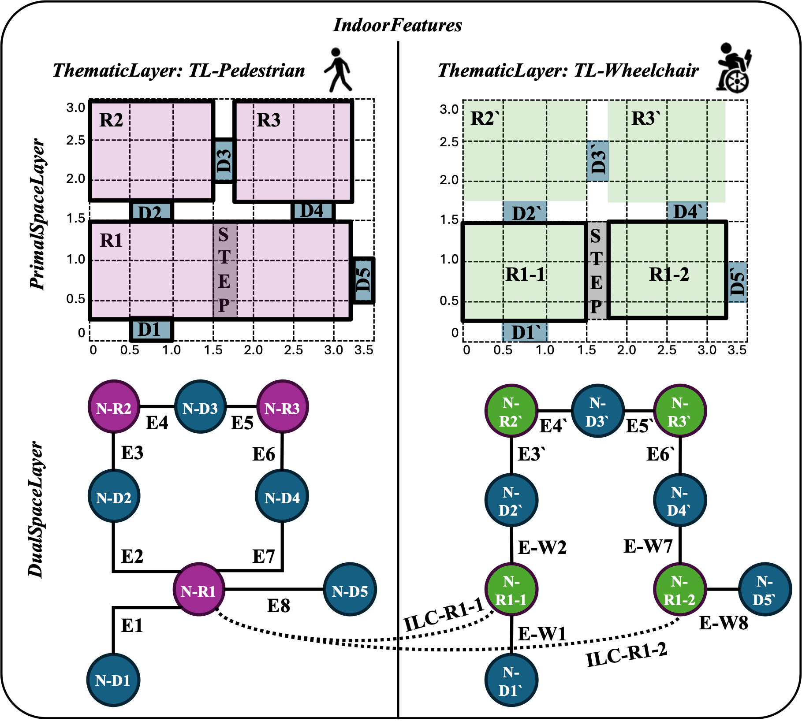

[[section-indoorsql-core]]
== SQL Encoding of the Core Module

[requirements_class]
====
[%metadata]
identifier:: http://www.opengis.net/spec/indoorgml-2/2.0/sql/req/core
subject:: Implementation Specification
inherit:: http://www.opengis.net/spec/indoorgml/2.0/req
requirement:: /req/core/global
requirement:: /req/core/indoorsql
requirement:: /req/core/indoorfeature
requirement:: /req/core/thematiclayer
requirement:: /req/core/primalspacelayer
requirement:: /req/core/cellspace
requirement:: /req/core/cellboundary
requirement:: /req/core/dualspacelayer
requirement:: /req/core/node
requirement:: /req/core/edge
requirement:: /req/core/interlayerconnection
====

[[section-core-general]]
=== General requirements for encoding standard

An implementation of IndoorGML 2.0 Core using SQL SHALL implement the relational schema defined by this standard.

[[req-core-global]]
[requirement]
.Requirement for global SQL schema
====
[%metadata]
identifier:: /req/core/global
part:: A database representing an IndoorGML 2.0 Core dataset SHALL implement the SQL schema defined in this standard (including `IndoorGML_core.sql` and the PostGIS geometry types specified in <<section-conventions>>).
====

Each feature table of the SQL encoding represents one feature class of the IndoorGML 2.0 conceptual model.

Every feature table:

* *must* have a primary key column storing a string identifier that serves as a unique identifier for the feature and can be used to represent cross-references between objects in the SQL encoding.

[[req-indoorsql]]
[requirement]
.Requirement for SQL encoding feature tables
====
[%metadata]
identifier:: /req/core/indoorsql
part:: Each feature table of the SQL encoding SHALL contain a string primary key column for the feature identifier.
====

Core code list `ENUM` types used by the core module tables are specified in <<annex_core_enums>>.

[[section-indoorfeatures]]
=== IndoorFeatures

The `IndoorFeatures` table stores instances of https://docs.ogc.org/is/22-045r5/22-045r5.html#section-indoorgml-core[IndoorFeature], the container for the indoor dataset.
It aggregates one or more thematic layers and may include inter-layer connections.

The `IndoorFeatures` table shall contain:

* `IndoorFeaturesID` as the primary key
* optionally, `layers` as a reference to associated thematic layers

NOTE: The `layers` column was added during schema correction because it was not included in the SQL generated from Enterprise Architecture tooling.

The following examples refer to an `IndoorFeatures` row shown in <<fig-sql-example-layout>>.
In the example, the indoor dataset aggregates `ThematicLayer` rows linked through the `IndoorFeaturesID` foreign key and `InterLayerConnection` rows stored in the `InterLayerConnection` table.
Each row is identified by a string primary key, which is referenced by foreign-key columns (such as `connectedLayers_1` or `connectedNodes_1` in `InterLayerConnection`).

[[fig-sql-example-layout]]
.SQL example layout

[[indoorfeature-schema]]
.A SQL schema of the IndoorFeatures table
[source,sql]
----
include::../schema/core/indoorfeatures.sql[]
----

[[indoorfeature-example]]
.An example INSERT statement for the IndoorFeatures table
[source,sql]
----
include::../examples/indoorfeatures.sql[]
----

[[req-indoorfeatures]]
[requirement]
.IndoorFeatures schema
====
[%metadata]
identifier:: /req/core/indoorfeature
part:: An `IndoorFeatures` table SHALL be related to at least one <<section-thematiclayer,`ThematicLayer`>> row through a foreign key.
====

[[section-thematiclayer]]
=== ThematicLayer

The `ThematicLayer` table stores instances of https://docs.ogc.org/is/22-045r5/22-045r5.html#subsection-tehmaticlayer[ThematicLayer], which represents one contextual decomposition of indoor space.

The `ThematicLayer` table shall contain:

* `ThematicLayerID` as the primary key
* `IndoorFeaturesID` as a foreign key to `IndoorFeatures`
* `semanticExtension` indicates whether there is an extension module with additional semantic information (mandatory)
* `theme` of type `ThemeLayerValue`, with values including "Virtual", "Physical", "Tags", and "Unknown" (mandatory)

[[thematiclayer-schema]]
.A SQL schema of the ThematicLayer table
[source,sql]
----
include::../schema/core/thematiclayer.sql[]
----

The following examples refer to a `ThematicLayer` row ("TL-Pedestrian"), shown in <<fig-sql-example-layout>>.

[[thematiclayer-example]]
.An example INSERT statement for the ThematicLayer table
[source,sql]
----
include::../examples/thematiclayer.sql[]
----

[[req-thematiclayer]]
[requirement]
.ThematicLayer schema
====
[%metadata]
identifier:: /req/core/thematiclayer
part:: A `ThematicLayer` table SHALL declare whether there is an extension module with additional semantic information using the `semanticExtension` column.
part:: A `ThematicLayer` table SHALL determine what type of model representation can be expected using the `theme` column.
part:: The `theme` value SHALL be one of "Virtual", "Physical", "Tags", and "Unknown".
====

[[section-primalspacelayer]]
=== PrimalSpaceLayer

The `PrimalSpaceLayer` table stores instances of https://docs.ogc.org/is/22-045r5/22-045r5.html#subsection-primalspacelayer[PrimalSpaceLayer], which contains spatial objects representing indoor subdivisions.

The `PrimalSpaceLayer` table shall contain:

* `PrimalSpaceLayerID` as the primary key
* `ThematicLayerID` as a foreign key to `ThematicLayer` (mandatory)
* optionally, `creationDate`
* optionally, `terminationDate`

[[primalspacelayer-schema]]
.A SQL schema of the PrimalSpaceLayer table
[source,sql]
----
include::../schema/core/primalspacelayer.sql[]
----

The following examples refer to a `PrimalSpaceLayer` row of "TL-Pedestrian", shown in <<fig-sql-example-layout>>.

[[primalspacelayer-example]]
.An example INSERT statement for the PrimalSpaceLayer table
[source,sql]
----
include::../examples/primalspacelayer.sql[]
----

[[req-primalspacelayer]]
[requirement]
.PrimalSpaceLayer schema
====
[%metadata]
identifier:: /req/core/primalspacelayer
part:: A `PrimalSpaceLayer` table SHALL be related to one or more <<section-cellspace,CellSpace>> rows.
====

[[section-cellspace]]
=== CellSpace

The `CellSpace` table stores instances of https://docs.ogc.org/is/22-045r5/22-045r5.html#subsection-cellspace[CellSpace], which represents a unit of indoor space.

The `CellSpace` table shall contain:

* `CellSpaceID` as the primary key
* `PrimalSpaceLayerID` as a foreign key to `PrimalSpaceLayer`
* `PoI` is a flag that specifies whether this cell space is a point of interest (mandatory)
* `duality` referencing the `NodeID` of the dual node (mandatory)
* optionally, `cellSpaceName`
* optionally, `level`
* optionally, `cellSpaceGeom_Geometry2D` as a PostGIS `geometry` value (UML `CellSpaceGeometryType.Geometry2D`)
* optionally, `cellSpaceGeom_Geometry3D` as a PostGIS `geometry` value representing UML `GM_Solid` / `CellSpaceGeometryType.Geometry3D` as a closed boundary shell (`POLYHEDRALSURFACE Z` or `TIN Z`; see <<section-conventions>>)
* optionally, `externalReference` of composite type `ExternalReferenceType`

When `cellSpaceGeom_Geometry3D` is present, a `CHECK` constraint requires `GeometryType(...)` to be `POLYHEDRALSURFACE` or `TIN`, `ST_NDims(...)` to be 3, and `CG_IsSolid(CG_MakeSolid(...))` to be true (the stored shell is converted to a solid and then tested; see <<section-conventions>>).

[[cellspace-schema]]
.A SQL schema of the CellSpace table
[source,sql]
----
include::../schema/core/cellspace.sql[]
----

The following examples refer to a `CellSpace` row ("R1"), shown in <<fig-sql-example-layout>>.

[[cellspace-example]]
.An example INSERT statement for the CellSpace table
[source,sql]
----
include::../examples/cellspace.sql[]
----

[[req-cellspace]]
[requirement]
.CellSpace schema
====
[%metadata]
identifier:: /req/core/cellspace
part:: A `CellSpace` table SHALL declare whether it is a point of interest space using the `PoI` column.
part:: A `CellSpace` table SHALL contain a `duality` value referencing the `NodeID` of the corresponding <<section-node,Node>>.
part:: A non-null `cellSpaceGeom_Geometry2D` value SHALL have the geometry type `POLYGON` or `MULTIPOLYGON`.
part:: A non-null `cellSpaceGeom_Geometry3D` value SHALL have the geometry type `POLYHEDRALSURFACE` or `TIN`.
part:: A non-null `cellSpaceGeom_Geometry3D` value SHALL have three coordinate dimensions (`ST_NDims(...) = 3`) and SHALL be a solid after `CG_MakeSolid(...)`, as tested by `CG_IsSolid(CG_MakeSolid(...))`.
====

[[section-cellboundary]]
=== CellBoundary

The `CellBoundary` table stores instances of https://docs.ogc.org/is/22-045r5/22-045r5.html#subsection-cellboundary[CellBoundary], a boundary of a CellSpace.
`CellBoundary` rows reference `CellSpace` rows through the `boundedBy` foreign key column.
Optionally, a `CellBoundary` may be the dual of an `Edge`; this association is encoded on the `Edge` table via the optional `Edge.duality` foreign key referencing `CellBoundaryID`.

The `CellBoundary` table shall contain:

* `CellBoundaryID` as the primary key
* `PrimalSpaceLayerID` as a foreign key to `PrimalSpaceLayer` (mandatory)
* `isVirtual` indicating whether the boundary is virtual or physical (mandatory)
* optionally, `boundedBy` referencing the `CellSpaceID` of a bounded cell space
* optionally, `cellBoundaryGeom_Geometry1D` as a PostGIS `geometry` value (UML `CellBoundaryGeometryType.Geometry1D`, typically a curve)
* optionally, `cellBoundaryGeom_Geometry2D` as a PostGIS `geometry` value (UML `CellBoundaryGeometryType.Geometry2D`, typically a surface)
* optionally, `externalReference` of composite type `ExternalReferenceType`

[[cellboundary-schema]]
.A SQL schema of the CellBoundary table
[source,sql]
----
include::../schema/core/cellboundary.sql[]
----

The following examples refer to a `CellBoundary` row ("B1"), shown in <<fig-sql-example-layout>>.

[[cellboundary-example]]
.An example INSERT statement for the CellBoundary table
[source,sql]
----
include::../examples/cellboundary.sql[]
----

[[req-cellboundary]]
[requirement]
.CellBoundary schema
====
[%metadata]
identifier:: /req/core/cellboundary
part:: A `CellBoundary` table SHALL specify whether it is virtual using the `isVirtual` column.
part:: A non-null `cellBoundaryGeom_Geometry1D` value SHALL have the geometry type `LINESTRING` or `MULTILINESTRING`.
part:: A non-null `cellBoundaryGeom_Geometry2D` value SHALL have the geometry type `POLYGON` or `MULTIPOLYGON`.
====

[[section-dualspacelayer]]
=== DualSpaceLayer

The `DualSpaceLayer` table stores instances of https://docs.ogc.org/is/22-045r5/22-045r5.html#subsection-dualspacelayer[DualSpaceLayer], representing the graph structure corresponding to the primal space layer.

The `DualSpaceLayer` table shall contain:

* `DualSpaceLayerID` as the primary key
* `ThematicLayerID` as a foreign key to `ThematicLayer` (mandatory)
* `isLogical` indicating whether the graph is geometric or logical (mandatory)
* `isDirected` specifying whether the graph is directed (mandatory)
* optionally, `creationDate`
* optionally, `terminationDate`

[[dualspacelayer-schema]]
.A SQL schema of the DualSpaceLayer table
[source,sql]
----
include::../schema/core/dualspacelayer.sql[]
----

The following examples refer to a `DualSpaceLayer` row of "TL-Pedestrian", shown in <<fig-sql-example-layout>>.

[[dualspacelayer-example]]
.An example INSERT statement for the DualSpaceLayer table
[source,sql]
----
include::../examples/dualspacelayer.sql[]
----

[[req-dualspacelayer]]
[requirement]
.DualSpaceLayer schema
====
[%metadata]
identifier:: /req/core/dualspacelayer
part:: A `DualSpaceLayer` table SHALL specify whether the provided graph is geometric or logical using the `isLogical` column.
part:: A `DualSpaceLayer` table SHALL specify whether the provided graph is directed using the `isDirected` column.
part:: A `DualSpaceLayer` table SHALL be related to one or more <<section-node,`Node`>> rows.
====

[[section-node]]
=== Node

The `Node` table stores instances of https://docs.ogc.org/is/22-045r5/22-045r5.html#subsection-node[Node], a state or graph vertex in the dual space layer.

The `Node` table shall contain:

* `NodeID` as the primary key
* `DualSpaceLayerID` as a foreign key to `DualSpaceLayer` (mandatory)
* `duality` referencing the `CellSpaceID` of the corresponding cell space (mandatory)
* optionally, `geometry` as a PostGIS `geometry` value (typically `Point`)
* optionally, `connects` as a `jsonb` array of connected `EdgeID` values

[[node-schema]]
.A SQL schema of the Node table
[source,sql]
----
include::../schema/core/node.sql[]
----

The following examples refer to a `Node` row ("N-R1"), shown in <<fig-sql-example-layout>>.

[[node-example]]
.An example INSERT statement for the Node table
[source,sql]
----
include::../examples/node.sql[]
----

[[req-node]]
[requirement]
.Node schema
====
[%metadata]
identifier:: /req/core/node
part:: A `Node` table SHALL contain a `duality` value referencing the `CellSpaceID` of the corresponding <<section-cellspace,CellSpace>>.
part:: A `Node` table SHALL store connected edge identifiers in the `connects` column.
part:: A non-null `Node` `geometry` value SHALL have the geometry type `POINT`.
====

[[section-edge]]
=== Edge

The `Edge` table stores instances of https://docs.ogc.org/is/22-045r5/22-045r5.html#subsection-edge[Edge], representing a relationship between two nodes.

The `Edge` table shall contain:

* `EdgeID` as the primary key
* `DualSpaceLayerID` as a foreign key to `DualSpaceLayer` (mandatory)
* `weight` for use in graph-based applications (mandatory)
* `connects_node1` and `connects_node2` as foreign keys to the two connected `Node` rows (mandatory)
* optionally, `duality` referencing the `CellBoundaryID` of the corresponding cell boundary
* optionally, `geometry` as a PostGIS `geometry` value (typically `LineString`)

NOTE: If no list of connected edges is presented on `Node` (that is, `Node.connects` is absent or empty), the `Edge` table SHALL provide the connect properties `connects_node1` and `connects_node2` so that the dual-space graph adjacency can be determined from the `Edge` rows.

[[edge-schema]]
.A SQL schema of the Edge table
[source,sql]
----
include::../schema/core/edge.sql[]
----

The following examples refer to an `Edge` row ("E1"), shown in <<fig-sql-example-layout>>.

[[edge-example]]
.An example INSERT statement for the Edge table
[source,sql]
----
include::../examples/edge.sql[]
----

[[req-edge]]
[requirement]
.Edge schema
====
[%metadata]
identifier:: /req/core/edge
part:: An `Edge` table SHALL reference connected <<section-node,Nodes>> using the `connects_node1` and `connects_node2` columns.
part:: An `Edge` table SHALL contain a `weight` column.
part:: A non-null `Edge` `geometry` value SHALL have the geometry type `LINESTRING` or `MULTILINESTRING`.
====

[[section-interlayerconnection]]
=== InterLayerConnection

The `InterLayerConnection` table stores instances of https://docs.ogc.org/is/22-045r5/22-045r5.html#subsection-interlayerconnection[InterLayerConnection].
In the IndoorGML 2.0 conceptual model, an `InterLayerConnection` describes the connection between two thematic layers and may also identify the cell spaces and/or nodes that participate in that connection.
It is used when objects in different thematic layers (for example, a pedestrian layer and a wheelchair layer, or a room layer and a furniture layer) need an explicit topological relationship.

The `InterLayerConnection` table shall contain:

* `InterLayerConnectionID` as the primary key
* `IndoorFeaturesID` as a foreign key to `IndoorFeatures`
* `typeOfTopoExpression` of type `TopoExpressionValue`, with values including "Contains", "Overlaps", "Equals", "Within", "Crosses", and "Other" (mandatory)
* `connectedLayers_1` and `connectedLayers_2` as foreign keys to the two connected `ThematicLayer` rows (mandatory)
* optionally, `connectedNodes_1` and `connectedNodes_2` as foreign keys to a pair of connected `Node` rows
* optionally, `connectedCells_1` and `connectedCells_2` as foreign keys to a pair of connected `CellSpace` rows
* optionally, `comment`

The `typeOfTopoExpression` column represents the topological relationship between the two layers.
Its values include "Contains", "Overlaps", "Equals", "Within", "Crosses", and "Other", according to the conceptual model.
Those topological values are verbs for which the subject is the first connected layer: one shall read `connectedLayers_1` _typeOfTopoExpression_ `connectedLayers_2` (for example, Layer Room _Contains_ Layer Furniture).

The paired columns encode the ordered associations of the conceptual model and SHALL be mapped to the same indices.
`connectedLayers_1`, `connectedNodes_1`, and `connectedCells_1` refer to the first side of the relationship (the subject of `typeOfTopoExpression`); `connectedLayers_2`, `connectedNodes_2`, and `connectedCells_2` refer to the second side.
For example, if `typeOfTopoExpression` is "Contains", then `connectedCells_1` contains `connectedCells_2` (and likewise for the corresponding nodes, when present).
When present, `connectedNodes_*` and `connectedCells_*` shall be populated as a pair (both null, or both non-null), corresponding to the IndoorGML cardinalities of 0 or 2.
`connectedCells` is used when the connection is between primal spaces; `connectedNodes` is used when the connection is between dual spaces.

[[interlayerconnection-schema]]
.A SQL schema of the InterLayerConnection table
[source,sql]
----
include::../schema/core/interlayerconnection.sql[]
----

The following examples refer to an `InterLayerConnection` row ("ILC-R1-1"), shown in <<fig-sql-example-layout>>.
For example, consider a cell space ("R1") containing a step that pedestrians can traverse but that is difficult for wheelchairs to cross.
If this distinction leads to the creation of separate thematic layers for pedestrians and wheelchairs, the cell space "R1" is split into "R1-1" and "R1-2" based on the step (a process known as subspacing).
In this case, since "R1" and "R1-1" (and "R1-2") represent the same physical space, they have a "Contains" relationship.
As shown in the example, this can be represented as "ILC-R1-1" (and "ILC-R1-2").

[[interlayerconnection-example]]
.An example INSERT statement for the InterLayerConnection table
[source,sql]
----
include::../examples/interlayerconnection.sql[]
----

[[req-interlayerconnection]]
[requirement]
.InterLayerConnection schema
====
[%metadata]
identifier:: /req/core/interlayerconnection
part:: An `InterLayerConnection` table SHALL reference the two connected <<section-thematiclayer,ThematicLayer>> rows using the `connectedLayers_1` and `connectedLayers_2` columns.
part:: An `InterLayerConnection` table SHALL store the topological relationship in the `typeOfTopoExpression` column, whose subject is `connectedLayers_1` (and, when present, `connectedNodes_1` / `connectedCells_1`).
part:: The `typeOfTopoExpression` value SHALL be one of "Contains", "Overlaps", "Equals", "Within", "Crosses", or "Other".
part:: The values of `connectedLayers_*`, `connectedNodes_*`, and `connectedCells_*` SHALL be ordered and mapped to the same indices (`_1` with `_1`, `_2` with `_2`).
part:: When connected nodes are provided, an `InterLayerConnection` table SHALL populate both `connectedNodes_1` and `connectedNodes_2`.
part:: When connected cell spaces are provided, an `InterLayerConnection` table SHALL populate both `connectedCells_1` and `connectedCells_2`.
====

[[section-externalreference]]
=== ExternalReferenceType

The UML DataTypes `ExternalObjectReferenceType` and `ExternalReferenceType` are encoded as PostgreSQL composite types rather than as tables.
These are not feature classes of IndoorGML 2.0.
`CellSpace` and `CellBoundary` optionally store an `externalReference` column of type `ExternalReferenceType`, which nests an `externalObject` of type `ExternalObjectReferenceType` together with an `informationSystem` URI.

[[externalreferencetype-schema]]
.A SQL schema of the ExternalReference composite types
[source,sql]
----
include::../schema/core/externalreferencetype.sql[]
----
