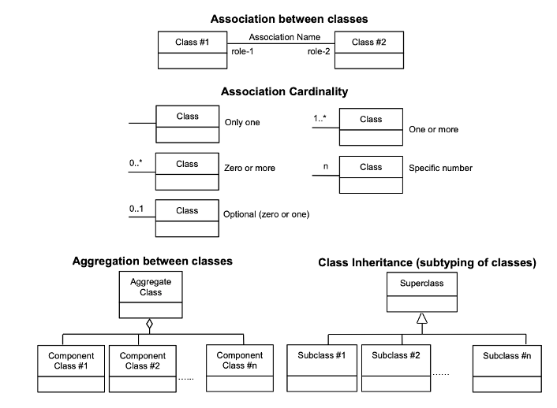

== Conventions

This sections provides details and examples for any conventions used in the document. Examples of conventions are symbols, abbreviations, use of XML schema, or special notes regarding how to read the document.

=== Symbols (and abbreviated terms)

The following symbols and abbreviated are used in this standard.
[[symbols]]
.Symbols and abbreviated terms
[]
|===
h| *Abbreviation* h| *Word or Phrase*
| BIM       | Building Information Modeling
| CityGML   | City Geographic Markup Language
| GPS       | Global Positioning Systems
| CRS       | Coordinate Reference System
| GML       | Geographic Markup Language
| IndoorGML | Indoor Geographic Markup Language
| IFC       | Industry Foundation Classes
| ISO       | International Organization for Standardization
| KML       | Keyhole Markup Language
| LOD       | Level of Detail
| MLSM      | Multi-Layered Space Model
| OGC       | Open Geospatial Consortium
| RFID      | Radio Frequency IDentifier
| UML       | Unified Modeling Language
| XML       | eXtended Markup Language
| 1D        | One Dimensional
| 2D        | Two Dimensional
| 3D        | Three Dimensional
|===

=== UML Notation

The diagrams that appear in this standard are presented using the Unified Modeling Language (UML) static structure diagram. The UML notations used in this standard are described in the diagram below.

[[uml-notations]]
.UML Notations

In this standard, the following three stereotypes of UML classes are used.

* \<<Interface>> A definition of a set of operations that is supported by objects having this interface. An Interface class cannot contain any attributes.
* \<<DataType>> A descriptor of a set of values that lack identity (independent existence and the possibility of side effects). A DataType is a class with no operations whose primary purpose is to hold the information.
* \<<CodeList>> is a flexible enumeration that uses string values for expressing a list of potential values.

In this standard, the following standard data types are used:

* CharacterString – A sequence of characters;
* Boolean – A binary value of either 1 (true) or 0 (false);
* Integer – An integer number;
* Double – A double precision floating point number; and
* Float – A single precision floating point number.

=== Identifiers
The normative provisions in this standard are denoted by the URI

`http://www.opengis.net/spec/indoorgml/2.0`

All requirements and conformance tests that appear in this document are denoted by partial URIs which are relative to this base.
